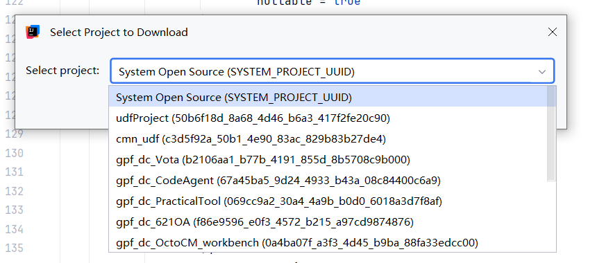

# 前置准备

获取对应工程项目，在项目中新增接口。
（项目工程一定要是对应自己使用的，或者需要添加接口的工程项目！！）


## 第一步：创建接口定义

以设备查询接口为例，演示 GET 请求实现。

**文件位置：** src/core/cell/你的项目/http/IXxxHttpMapping.java

```java
package cell.biam.oa.http;
import cell.CellIntf;
import cmn.anotation.ClassDeclare;
import cmn.anotation.InputDeclare;
import cmn.anotation.MethodDeclare;
import cmn.http.anotation.RequestMapping;
import cmn.http.anotation.RequestMethod;
import cmn.http.servlet.mapping.RequestMappingIntf;
import java.util.Map;
@ClassDeclare(
label = "设备查询接口",
what = "提供设备信息查询",
why = "给前端和移动端使用",
how = "HTTP GET请求"
)
@RequestMapping(path = "/biam-api/equipment")
public interface IBiamEquipmentApi extends CellIntf, RequestMappingIntf {
@MethodDeclare(
label = "查询设备详情",
what = "根据设备编号查询设备信息",
how = "GET /biam-api/equipment/{deviceNo}",
inputs = {
@InputDeclare(
name = "deviceNo",
label = "设备编号",
exampleValue = "{deviceNo}",
nullable = false
)
}
)
@RequestMapping(path = "/{deviceNo}", method = RequestMethod.GET)
Map<String, Object> getEquipment(String deviceNo) throws Exception;
}
```

## 关键点：

- 接口必须继承 CellIntf 和 RequestMappingIntf

- 类级路径 + 方法级路径 = 完整URL

- 路径参数用 {参数名}，查询参数不写 exampleValue

## 第二步：创建实现类

实现接口方法，编写业务逻辑。

**文件位置：** src/core/cell/你的项目/http/impl/CXxxHttpMapping.java

```java
package cell.biam.oa.http.impl;
import bap.cells.BasicCell_RequestMapping;
import cell.biam.oa.http.IBiamEquipmentApi;
import cell.cdao.IDao;
import cell.cdao.IDaoService;
import cell.gpf.adur.data.IFormMgr;
import gpf.adur.data.Form;
import gpf.adur.data.ResultSet;
import org.nutz.dao.Cnd;
import java.util.LinkedHashMap;
import java.util.List;
import java.util.Map;
public class CBiamEquipmentApi extends BasicCell_RequestMapping
implements IBiamEquipmentApi {
@Override
public Map<String, Object> getEquipment(String deviceNo) throws Exception {
// 1. 参数校验
if (deviceNo == null || deviceNo.trim().isEmpty()) {
throw new IllegalArgumentException("设备编号不能为空");
}
// 2. 查询数据
try (IDao dao = IDaoService.newIDao()) {
IFormMgr formMgr = IFormMgr.get();
// 获取字段编码
String fieldCode = formMgr.getFieldCode("设备编号");
// 构造查询条件
Cnd cnd = Cnd.where(fieldCode, "=", deviceNo);
// 执行查询
ResultSet<Form> rs = formMgr.queryFormPage(
dao,
"你的模型面板ID",  // 改成实际的modelId
cnd,
1,      // 第1页
1,      // 每页1条
false,  // 不查总数
true    // 查询完整字段
);
List<Form> list = rs.getDataList();
if (list == null || list.isEmpty()) {
throw new IllegalArgumentException("设备不存在");
}
// 3. 组装返回数据
Form form = list.get(0);
Map<String, Object> result = new LinkedHashMap<>();
result.put("deviceNo", form.getString("设备编号"));
result.put("deviceName", form.getString("设备名称"));
result.put("status", form.getString("设备状态"));
return result;
}
}
}
```

## 关键点：

- 实现类继承 BasicCell_RequestMapping

- 用 getFieldCode() 把中文字段名转成字段编码

- 用 ResultSet.getDataList() 获取数据列表

- 返回 Map 或 DTO 对象

- 模型面板id示例——》"octocm.md.GroupChat_Inst_17790942612666.iML_00041_CM"

## 第三步：配置分发器

注册路由，让平台识别你的接口。

**文件位置：** src/core/cell/你的项目/http/dispatcher/XxxDispatcherMappingBuilder.java

```java
package cell.biam.oa.http.dispatcher;
import cmn.http.handler.HttpRequestHandler;
import cmn.http.handler.HttpResponseHandler;
import cmn.http.handler.impl.DefaultHttpRequestHandler;
import cmn.http.handler.impl.DefaultHandlerMapping;
import cmn.http.servlet.mapping.DispatcherMappingBuilder;
import cmn.http.servlet.mapping.HandlerInterceptor;
import cmn.http.servlet.mapping.HandlerMapping;
import cell.biam.oa.http.handler.BiamHttpResponseHandler;
import java.util.ArrayList;
import java.util.List;
public class BiamDispatcherMappingBuilder implements DispatcherMappingBuilder {
@Override
public String[] getIncludePatterns() {
return new String[]{"/biam-api/**"};  // 你的路径前缀
}
@Override
public String[] getExcludePatterns() {
return null;
}
@Override
public HandlerMapping getHandlerMapping() {
HttpRequestHandler requestHandler = new DefaultHttpRequestHandler();
HttpResponseHandler responseHandler = new BiamHttpResponseHandler();
DefaultHandlerMapping mapping = new DefaultHandlerMapping(
getIncludePatterns(),
getExcludePatterns(),
requestHandler
);
mapping.setInterceptors(new ArrayList<>());
mapping.setRespHandler(responseHandler);
return mapping;
}
}
```

## 关键点：

- getIncludePatterns() 声明路径前缀

- 一个项目只需要一个分发器

## 第四步：配置响应处理器

统一包装JSON响应。

**文件位置：** src/core/cell/你的项目/http/handler/XxxHttpResponseHandler.java

```java
package cell.biam.oa.http.handler;
import cmn.http.handler.HttpResponseHandler;
import com.alibaba.fastjson.JSON;
import javax.servlet.http.HttpServletResponse;
public class BiamHttpResponseHandler implements HttpResponseHandler {
@Override
public void handle(HttpServletResponse response, Object result, Exception exception)
throws Exception {
response.setContentType("application/json;charset=UTF-8");
ApiResponse<?> apiResponse;
if (exception != null) {
// 异常处理
if (exception instanceof IllegalArgumentException) {
apiResponse = ApiResponse.failure("BAD_REQUEST", exception.getMessage());
} else {
apiResponse = ApiResponse.failure("INTERNAL_ERROR", "服务器内部错误");
}
} else {
// 成功包装
apiResponse = ApiResponse.success(result);
}
String json = JSON.toJSONString(apiResponse);
response.getWriter().write(json);
}
}
```

## ApiResponse 类：

```java
package cell.biam.oa.http.handler;
public class ApiResponse<T> {
private String code;
private String message;
private T data;
public ApiResponse(String code, String message, T data) {
this.code = code;
this.message = message;
this.data = data;
}
public static <T> ApiResponse<T> success(T data) {
return new ApiResponse<>("SUCCESS", "处理成功", data);
}
public static <T> ApiResponse<T> failure(String code, String message) {
return new ApiResponse<>(code, message, null);
}
// getter/setter...
}
```

## 第五步：发布和测试

## 发布到平台

使用 BapDev CLI 或 IDE 插件发布到云端，等待发布完成。

## 测试接口

## 用浏览器测试：

http://你的服务器/biam-api/equipment/SB001

## 用 Postman 测试：

- Method: GET

- URL: http://你的服务器/biam-api/equipment/SB001

- 无需请求头

## 预期响应：

```java
{
"code": "SUCCESS",
"message": "处理成功",
"data": {
"deviceNo": "SB001",
"deviceName": "MacBook Pro",
"status": "在用"
}
}
```

## 常见参数类型示例

## 查询参数（GET）

```java
// 接口定义
@InputDeclare(name = "keyword", label = "关键词", nullable = true)
Map<String, Object> search(String keyword) throws Exception;
// 访问
GET /api/search?keyword=电脑
```

## 路径参数（GET）

```java
// 接口定义
@InputDeclare(name = "id", exampleValue = "{id}")
Map<String, Object> getById(Long id) throws Exception;
// 访问
GET /api/device/123
```

## 请求体（POST）

```java
// 接口定义
@InputDeclare(name = "request", exampleValue = "$RequestBody$")
Map<String, Object> create(DeviceDto request) throws Exception;
// 访问
POST /api/device
Content-Type: application/json
{
"name": "电脑",
"price": 5000
}
```

## 发布前检查清单

- 接口继承了 CellIntf 和 RequestMappingIntf

- 实现类继承了 BasicCell_RequestMapping

- 路径参数的 @InputDeclare.name 与方法参数名一致

- 路径参数声明了 exampleValue = "{参数名}"

- 请求体参数声明了 exampleValue = "$RequestBody$"

- DTO 类实现了 Serializable

- 分发器配置了正确的路径前缀

- 响应处理器配置了 JSON 输出

## Spring Boot vs GPF 对比

| **Spring Boot** | **GPF** |
| --- | --- |
| @RestController | RequestMappingIntf 接口 + 实现类 |
| @GetMapping | @RequestMapping(method = GET) |
| @RequestParam | @InputDeclare(name="xxx") |
| @PathVariable | @InputDeclare(exampleValue="{xxx}") |
| @RequestBody | @InputDeclare(exampleValue="$RequestBody$") |
| 自动扫描 | DispatcherMappingBuilder 手动注册 |
| @RestControllerAdvice | HttpResponseHandler |

## 重要概念速查

| **概念** | **含义** |
| --- | --- |
| Form | 某个表单模型的一条记录，可以包含附件、关联和嵌套数据 |
| IFormMgr | 负责表单模型及表单数据的增删改查 |
| IDao | 数据库访问会话和事务载体，同一个 DAO 中的操作可以统一提交 |
| Cnd | 查询条件对象，类似 QueryWrapper |
| ResultSet<br>窗体顶端<br>窗体底端 | 分页查询结果，包含当前页数据和总记录数 |
| modelId | 后端操作数据时使用的完整模型标识 |
| fieldCode | 某个业务字段的内部编码，用于 Cnd 查询 |
| UUID | 每条 Form 记录的系统唯一标识，类似数据库主键 |
| Form.Code | 每条 Form 记录的系统编号，不是字段编码 |
