# 前置准备：编写操作函数

在代码中定义一个操作函数。

文件位置： src/core/cell/你的项目/rule/XxxScheduleRule.java

编译并发布到云端平台。

## 第一步：登录平台后台

访问平台管理地址，使用管理员账号登录。
注平台管理地址后缀是 PanelXPro

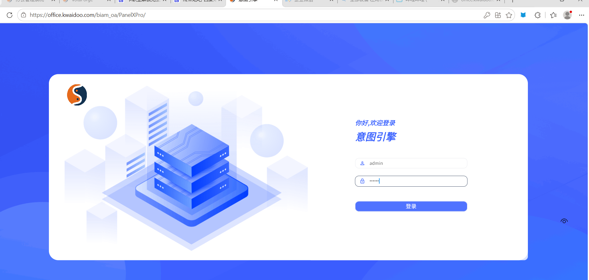

## 第一步（二）：选择一个业务域（自己正在使用的）

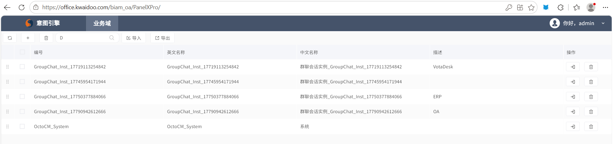

## 第二步：进入操作函数管理

在左侧菜单或顶部导航找到"操作函数"入口。
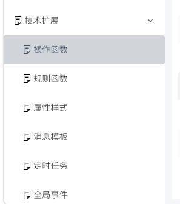

点击进入操作函数列表页面。

3.1 点击"新增操作函数"
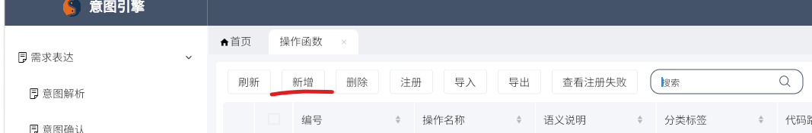

### 3.2 填写操作函数配置

在弹出的表单中填写以下信息：

| 字段 | 填写内容 | 说明 |
|-----|---------|------|
| 函数名称 | 资产设备每日统计 | 显示名称，随意填 |
| 规则命名空间 | octocm.md.GroupChat_Inst_17790942612666 | 你的业务域编号 |
| 调用表达式 | 资产设备每日统计() | 必须与@MethodDeclare的label一致，且带括号 |
| 分类 | C2 | 与@FuncDeclare的category一致 |
| 描述 | 每日统计设备状态分布 | 可选 |

图片为示例

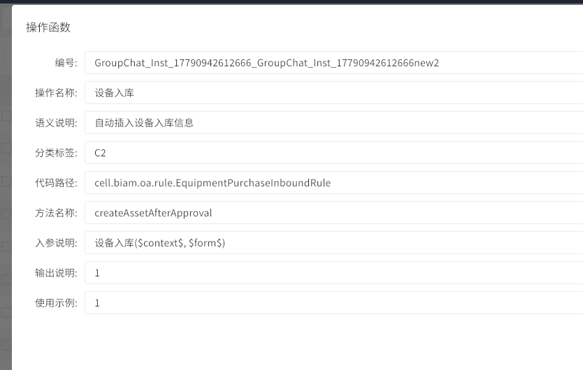

提示：

- 调用表达式必须带 ()

- 规则命名空间要选择对应的业务域

### 3.3 保存并发布

点击"保存"后，点击"发布"按钮。

## 第四步：配置定时任务

### 4.1 进入定时任务管理

在左侧菜单找到"定时任务"或"调度管理"入口。

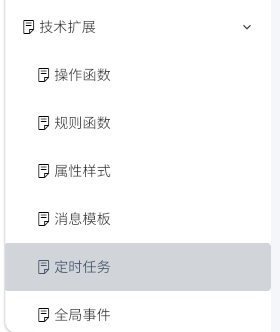

### 4.2 新增定时任务

点击左上角的"+"按钮。

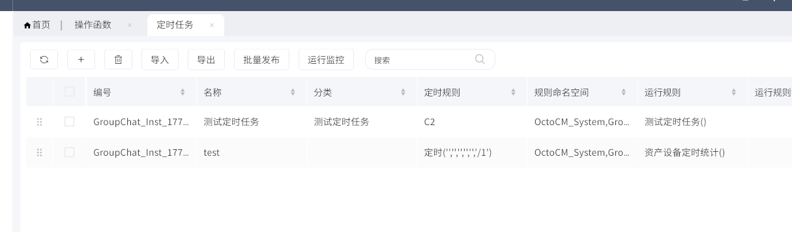

### 4.3 填写定时任务配置

| 字段 | 填写内容 | 说明 |
|-----|---------|------|
| 任务名称 | 每日设备统计任务 | 显示名称 |
| 执行类 | IScheduleRuleExecutor | 固定选择规则执行器 |
| 执行参数 | 见下方JSON | 关键配置 |
| 定时规则 | 0 0 2 ? | Cron表达式，每天凌晨2点 |
| 是否启用 | 是 | 勾选启用 |

示例：执行参数（JSON格式）：

```json
{  "namespaces": "octocm.md.GroupChat_Inst_17790942612666",  "rule": "资产设备每日统计()"}
```

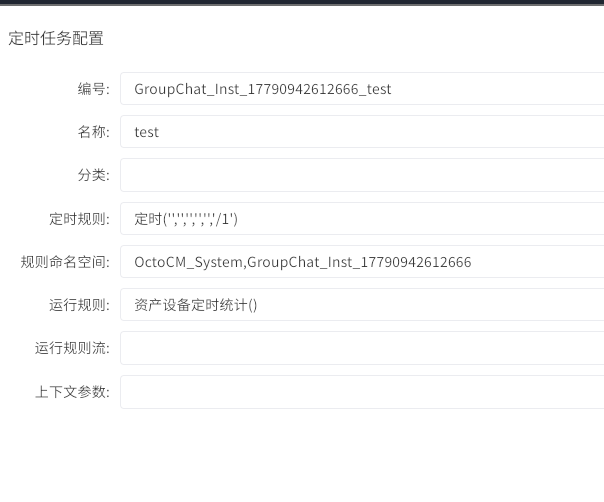

Cron表达式示例：

```text
0 0 2 * * ?          # 每天凌晨2点
0 */30 * * * ?       # 每30分钟
0 0 9 ? * MON-FRI    # 工作日上午9点
```

### 4.4 保存并启动

点击"保存"后，勾选刚刚保存的定时任务。
点击发布，需要出现 发布成功 提示 否则可能是函数或者配置等编辑错误

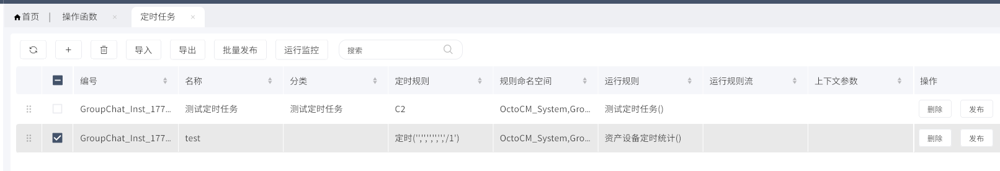

## 第五步：立即测试

不等定时触发，先手动测试一次。

### 5.1 点击"立即执行"

保存成功后，点击运行监控，进入发布好的定时任务列表（小人图标）
在任务列表中，找到刚创建的任务，点击"立即执行"或"手动触发"按钮。

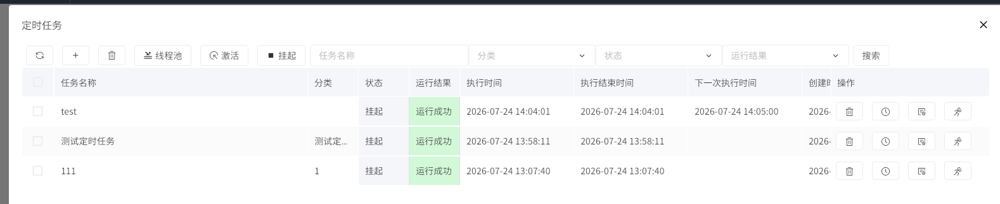

### 5.2 查看执行结果

点击后，系统会立即执行一次任务。

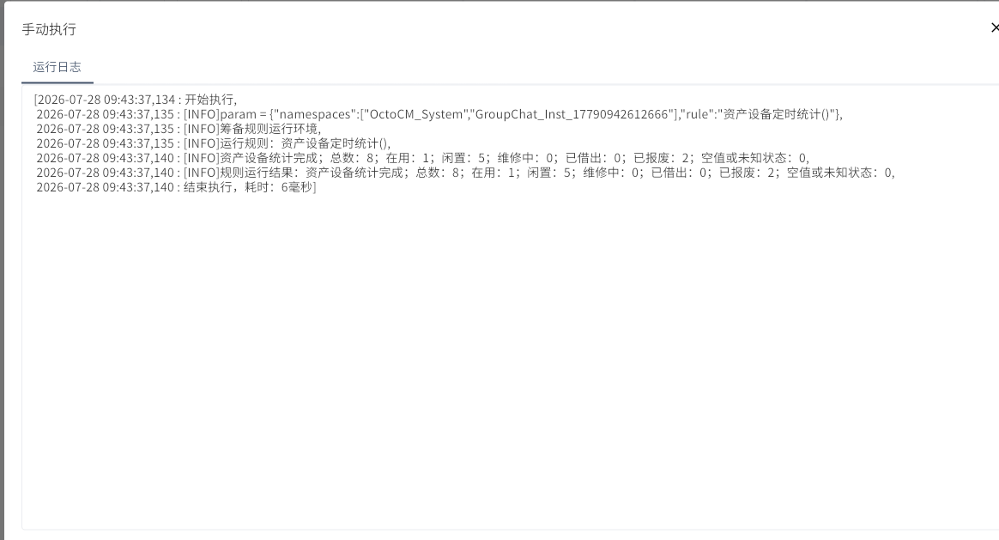

## 故障排查清单

任务执行失败时，依次检查：

### 1. 操作函数注册

- 调用表达式带了括号 ()

- 调用表达式与@MethodDeclare的label完全一致

- 规则命名空间正确

- 函数已发布

### 2. 定时任务配置

- 执行类选择了 IScheduleRuleExecutor

- 执行参数JSON格式正确（用在线工具验证）

- namespaces与操作函数的一致

- rule与操作函数的调用表达式一致

- Cron表达式格式正确（6位，不是5位）

### 3. 代码检查

- @FuncDeclare 注解存在

- 运行上下文参数用 $IDCRuntimeContext$

- 代码已编译并发布到云端

- 函数内部有日志输出（TraceUtil）

### 4. 运行环境

- 平台已刷新运行环境

- 业务域已启动

- 数据库连接正常

## 执行参数模板

### 标准规则执行器

```json
{  "namespaces": "你的业务域编号",  "rule": "操作函数名称()"}
```

### 带参数的规则（如果需要）

```json
{  "namespaces": "你的业务域编号",  "rule": "操作函数名称(参数1, 参数2)"}
```

## 小贴士

1. 先注册操作函数，再配置定时任务，顺序不能反

1. 调用表达式必须带括号，即使没有参数

1. 修改代码后要重新发布，并刷新平台环境

1. 先手动测试，确认成功后再启用定时

1. Cron是6位格式（秒 分 时 日 月 周），不是Linux的5位
