# VotaForge环境更新教程

## 前置准备

## 1.所需文件与操作平台

- 最新GPF压缩包（如 GPF\_7.6.24.zip）

- VotaForge前端包（VotaForge.zip）

- CDP前端包（CDP.zip）

- 需要使用Xterminal

## 2. 获取容器信息（需要环境申请通过）

登录

进入【申请】→【申请PAAS环境】或【产品】→【云服务器】，查看：

- **容器IP地址**（内网地址，如 192.168.0.230）

- **HTTP转发端口**（如 27009）

- **SSH端口** = HTTP端口的后两位改为22（如 27009 → 27022）

- **容器密码**（6位数字）

## 第一步：配置Xterminal连接

## （接下来更新包以7.24为例子）

## 进入Xterminal后

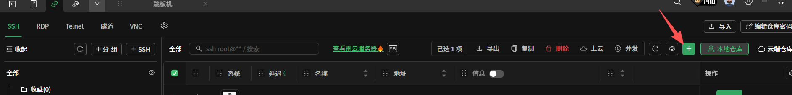

### 1.1 配置跳板机连接(这里的跳板机信息需要练习管理员获取)

打开Xterminal → 新建会话

## 会话配置1（跳板机）：

- **名称：** 跳板机

- **协议：** SSH

- **主机：** xxx

- **端口：** xx

- **用户名：** xxx

- **密码：** （联系管理员获取）

### 1.2 配置容器级联连接

在Xterminal中新建会话配置2（容器）

## 基本配置：

- **名称：** 容器（或你的环境名）

- **协议：** SSH

- **主机：** [容器内网IP]（如 192.168.0.230）

- **端口：** [SSH端口]（如 18022）

- **用户名：** root

- **密码：** 容器密码（6位数字）

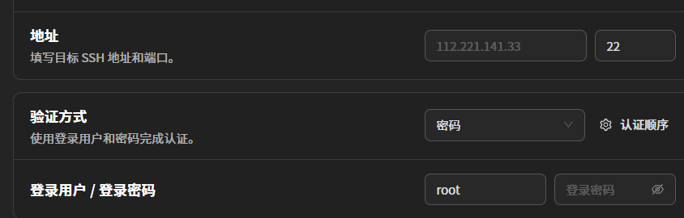

**代理/跳板机配置：**（关键步骤）

找到会话配置中的\*\*"代理"**、**"跳板机"**或**"SSH隧道"\*\*选项

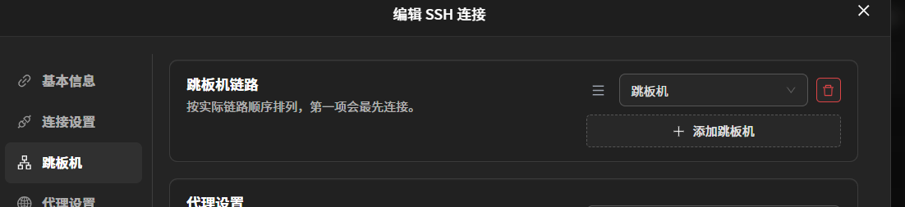

点击【保存】

### 1.3 测试连接

双击**"容器"**会话

如果配置正确，会：

1. 自动连接到跳板机

1. 通过跳板机连接到容器

1. 直接显示容器的命令提示符：root@xxxxxxxx:~#

**连接流程：** 你的电脑 → 跳板机(自动中转) → 容器
**文件传输：** 本地文件 → 跳板机中转 → 容器（跳板机不保留文件）

## 第二步：上传GPF到容器

### 2.1 直接上传到容器

确保已连接到"容器"会话

在左侧文件树中：

- 展开 data 文件夹

- 右键点击 data 文件夹 → **上传文件**

- 选择 GPF\_7.6.24.zip

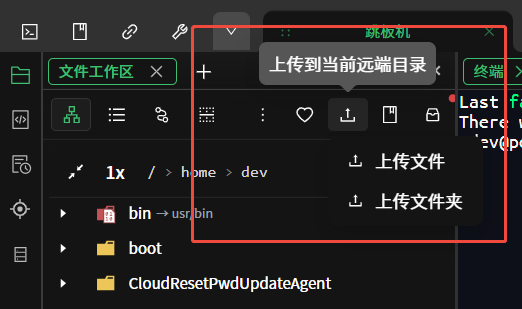文件会**通过跳板机自动中转上传**到容器的 /data 目录

### 2.2 验证上传

在终端执行：

cd /data

ls -lh GPF\_7.6.24.zip

应该显示文件大小约 336MB**(对应你需要更新版本包的实际大小)**

## 第三步：解压并配置GPF(解压语句里的压缩包为例)

### 3.1 解压GPF

cd /data

unzip GPF\_7.6.24.zip

解压完成后确认：

ls -lh /data/

应该看到 GPF\_7.6.24 目录

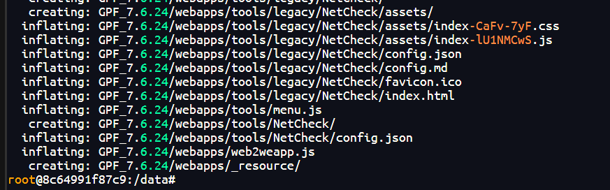

## **3.2 重要 更新启动脚本指向的地址**

### **步骤1：查看旧版本目录**

在终端执行：

ls /data/ | grep GPF

可能的输出示例：

- GPF\_7.6.22 和 GPF\_7.6.24

- 或 GPF\_VotaForge\_V1\_2 和 GPF\_7.6.24

记住旧版本的完整目录名

### **步骤2：查看启动脚本**

cat /data/startupPlatform.sh

**找到包含旧版本路径的行**，例如：

- cd /data/GPF\_7.6.22/bin

- 或 cd /data/GPF\_VotaForge\_V1\_2/bin

### **步骤3：替换路径**

命令模板(用于一键替换)：

sed -i 's/【旧目录名】/GPF\_7.6.24/g' /data/startupPlatform.sh

实际示例：

情况A： 如果旧版本是 GPF\_7.6.22

sed -i 's/GPF\_7.6.22/GPF\_7.6.24/g' /data/startupPlatform.sh

情况B： 如果旧版本是 GPF\_VotaForge\_V1\_2

sed -i 's/GPF\_VotaForge\_V1\_2/GPF\_7.6.24/g' /data/startupPlatform.sh

然后把旧地址全部修改新地址(7.6.24)

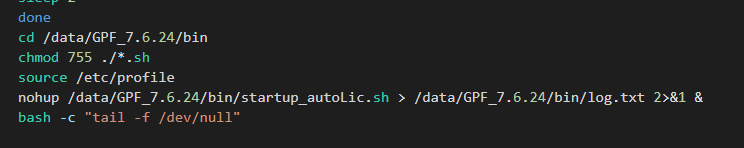

### **步骤4：确认修改**

cat /data/startupPlatform.sh

检查路径已改为 /data/GPF\_7.6.24/bin

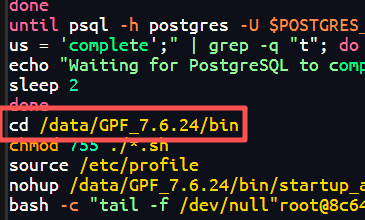

### 3.3 复制老版本的配置文件到新的版本里

## 命令模板：

cp -r /data/【旧目录名】/conf/\* /data/GPF\_7.6.24/conf/

## 实际示例：

## 情况A：

cp -r /data/GPF\_7.6.22/conf/\* /data/GPF\_7.6.24/conf/

## 情况B：

cp -r /data/GPF\_VotaForge\_V1\_2/conf/\* /data/GPF\_7.6.24/conf/

## 检查gdk配置：

cat /data/GPF\_7.6.24/conf/starter.xml | grep -i gdk

如果无输出，跳过此步。

## **3.4 恢复正确的版本信息**

在第3.3步中，我们从旧版本复制了所有配置文件到新版本中，其中包括：

- ✅ 需要保留的： license.data、base.conf 等（包含你环境的授权和数据库配置）

- ❌ 不该保留的： version.conf、release.md（这两个文件记录的是旧版本号）

结果： 新版本的配置文件被旧版本的覆盖了，导致系统显示的还是旧版本号。

这一步的目的： 把正确的版本信息文件恢复回来。

### **操作步骤**

第一步：从压缩包中提取正确的版本文件

unzip -o /data/GPF\_7.6.24.zip "GPF\_7.6.24/conf/release.md" "GPF\_7.6.24/conf/version.conf" -d /tmp/

第二步：把正确的版本文件复制回去

cp /tmp/GPF\_7.6.24/conf/release.md /data/GPF\_7.6.24/conf/

cp /tmp/GPF\_7.6.24/conf/version.conf /data/GPF\_7.6.24/conf/

解释：

- 把刚提取的正确版本文件，覆盖掉之前从旧版本复制来的错误文件

### **验证结果**

检查版本号是否正确：

# 查看发布说明

head -20 /data/GPF\_7.6.24/conf/release.md

# 查看版本配置

cat /data/GPF\_7.6.24/conf/version.conf | grep Version

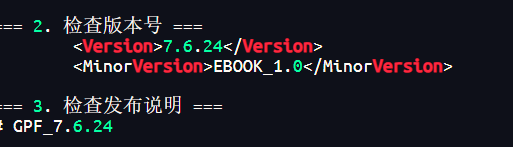

## 第四步：重启容器

### 4.1 退出容器

exit

### 4.2 在管理界面重启

打开浏览器，访问：

进入【产品】→【云服务器】

找到你的服务（根据环境名称识别），点击【重启】

等待容器重启完成（约1-2分钟），状态变为\*\*"运行中"\*\*

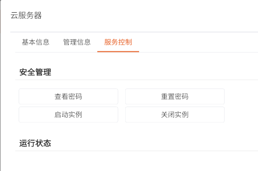

## 第五步：上传前端包

### 5.1 重新连接容器

在Xterminal中，双击\*\*"容器"\*\*会话重新连接

### 5.2 上传VotaForge和CDP前端包

在左侧文件树中：

- 展开 data → GPF\_7.6.24 → webapps

- 右键点击 webapps 文件夹 → **上传文件**

- 按住 Ctrl 多选 VotaForge.zip 和 CDP.zip（或分两次上传）

- 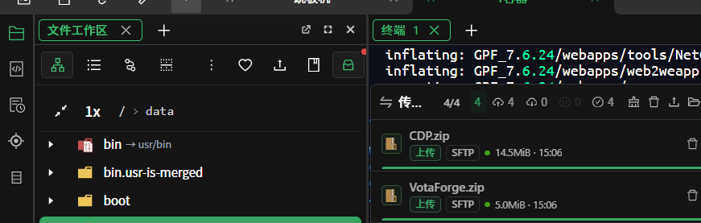

### 5.3 检查文件位置

**注意：** 有时文件会上传到 /root 而不是 webapps，需要检查并移动。

# 检查文件位置

ls -lh /data/GPF\_7.6.24/webapps/\*.zip

ls -lh /root/\*.zip

**如果文件在 /root**，执行移动命令：

mv /root/VotaForge.zip /data/GPF\_7.6.24/webapps/

mv /root/CDP.zip /data/GPF\_7.6.24/webapps/

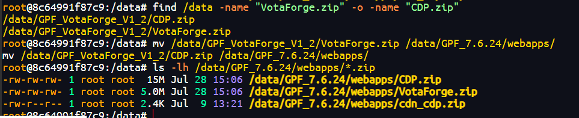

### 5.4 解压前端包

cd /data/GPF\_7.6.24/webapps/

unzip VotaForge.zip

unzip CDP.zip

查看解压结果：

ls -lh /data/GPF\_7.6.24/webapps/

应该看到：

- VotaForge/ 目录

- CDP/ 目录

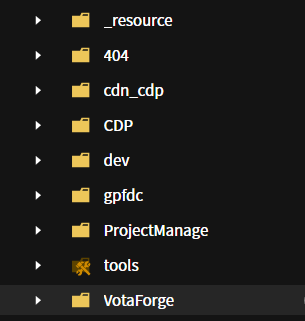

## 第六步：验证更新

## 先进入平台

### 6.1 检查运行进程

ps aux | grep java | grep GPF

确认Java进程路径包含 /data/GPF\_7.6.24/

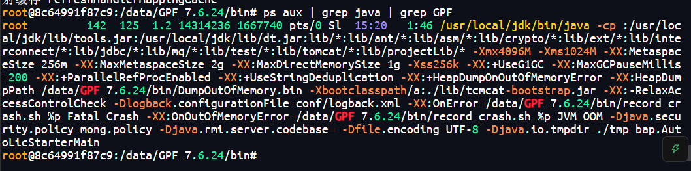

### 6.2 访问环境

打开浏览器，访问：

http://[你指定的映射域名].com/[你的域名路径]/VotaForge/xxtoken

## 示例：

【你的域名】/VotaForge/xxtoken

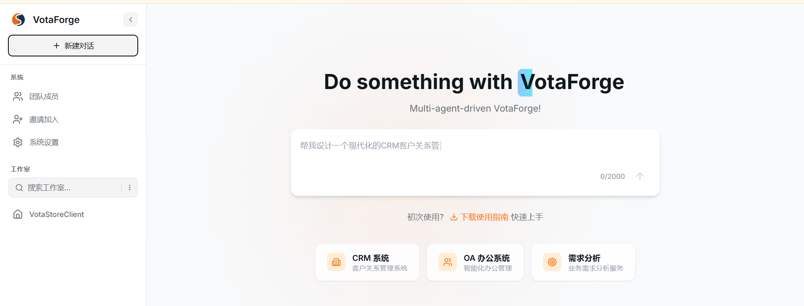
