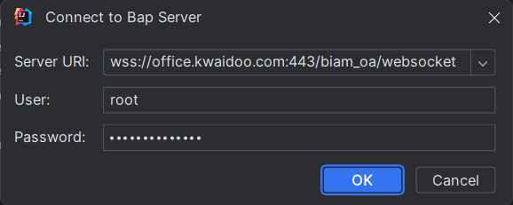
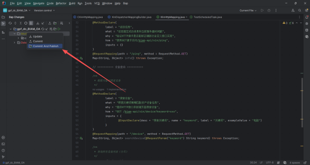
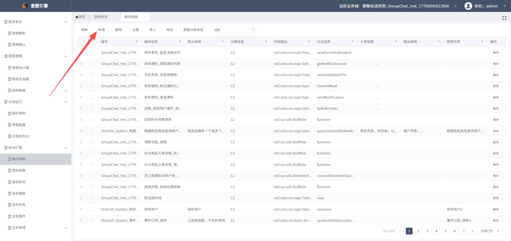
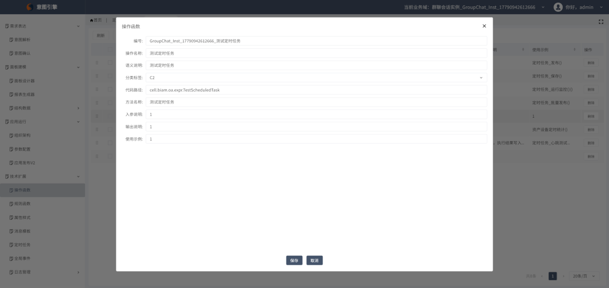
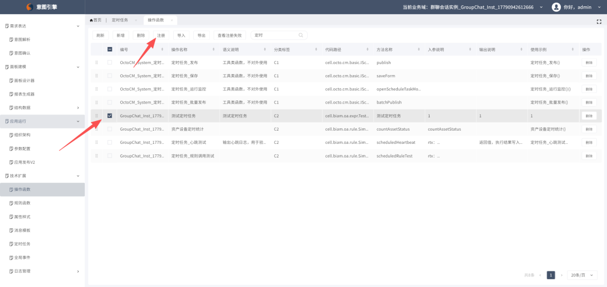
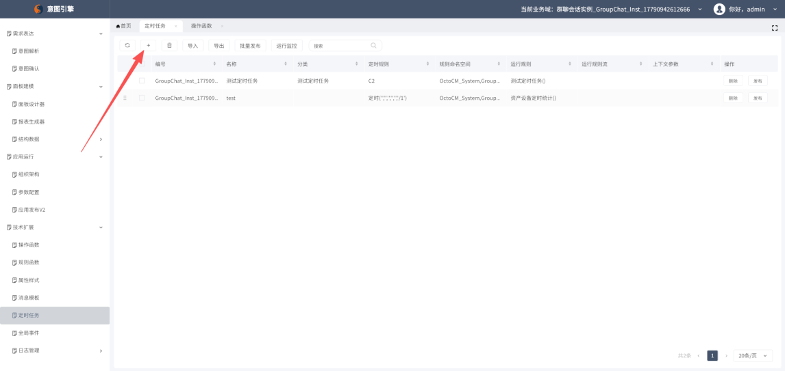
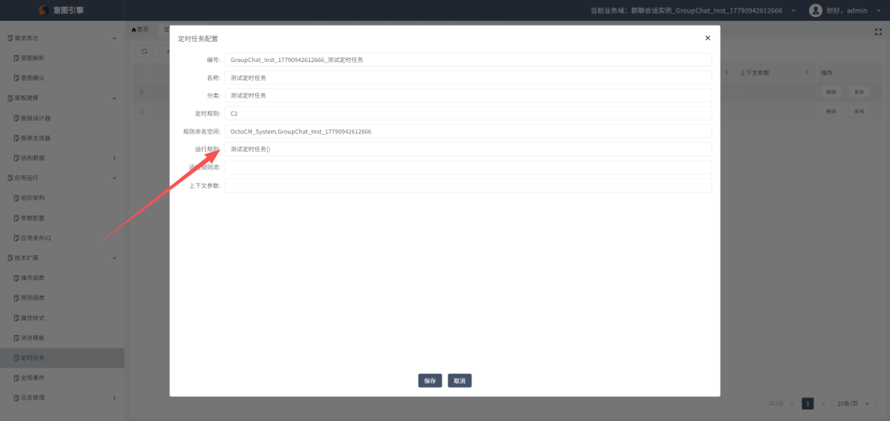
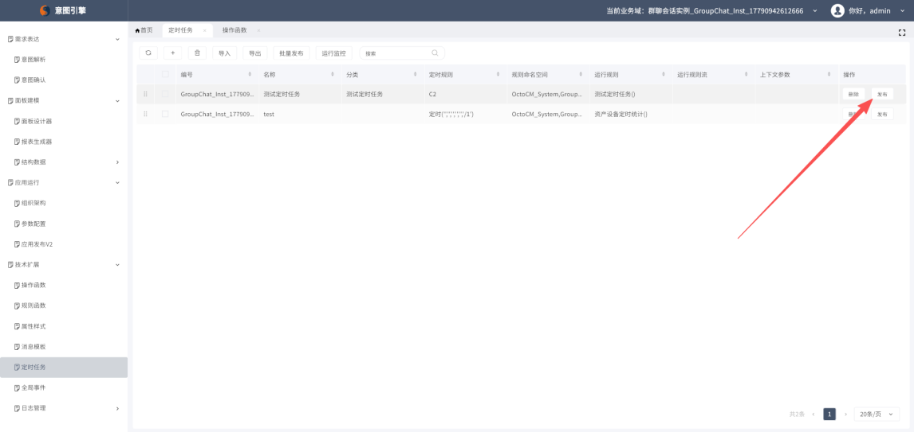
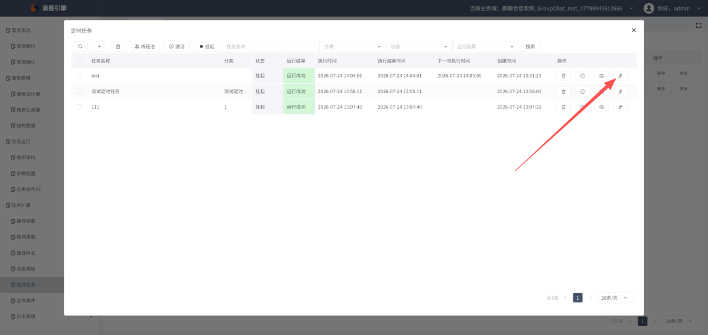
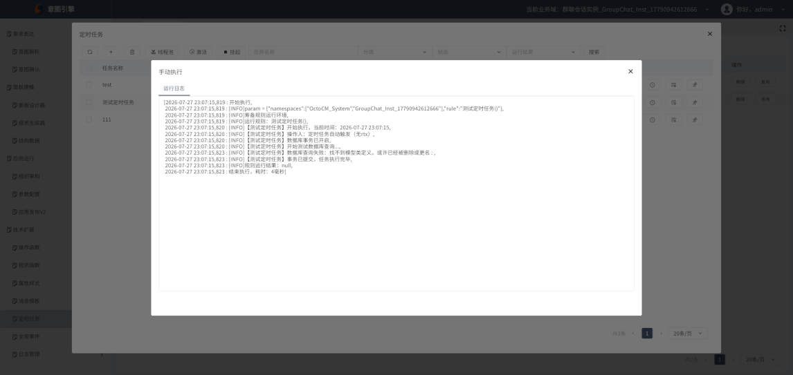

# 定时任务创建操作指南
5 步搞定 | 照着做就行
定时任务创建操作指南
5 步搞定 | 照着做就行

# 步骤一：进入自己的环境

## 操作
- 打开平台，登录进入自己的工作环境
- 确认当前页面为开发环境主页



图 1：进入自己的环境

# 步骤二：创建并编写操作函数

## 操作
- 在开发环境中新建一个 Java 接口文件
- 编写操作函数代码（见下方示例）
- 关键：@ClassDeclare 声明类信息，@MethodDeclare + @FuncDeclare(type=OPERATION) 声明操作函数，无参数方法供定时任务调用
操作函数代码示例：
```java
package cell.biam.oa.expr;
import cell.CellIntf;
import cell.cdao.IDao;
import cell.cdao.IDaoService;
import cell.gpf.adur.data.IFormMgr;
import cmn.anotation.ClassDeclare;
import cmn.anotation.MethodDeclare;
import cmn.exception.VerifyException;
import gpf.adur.data.Form;
import gpf.adur.data.ResultSet;
import octo.cm.annotation.FuncDeclare;
import cmn.util.TraceUtil;
import java.text.SimpleDateFormat;
import java.util.Date;
@ClassDeclare(
```
label = "测试定时任务",
what = "最简单的定时任务示例，用于测试定时任务链路是否通畅",
why = "新建定时任务后，先跑这个测试，验证配置是否正确",
how = "绑定到定时任务即可，每分钟/每小时触发一次",
developer = "User",
createTime = "2026-07-24",
updateTime = "2026-07-24",
version = "1.0"
)
```java
public interface TestScheduledTask extends CellIntf {
```
String FORM_MODEL_TEST = "";
/**
* 测试定时任务（无参数版本，供定时任务直接调用）
* 定时任务框架调用时不会注入rtx参数，因此用无参数版本
*/
```java
@MethodDeclare(
```
label = "测试定时任务",
what = "最简单的定时任务示例，验证定时任务链路是否通畅",
how = "定时任务触发后执行",
why = "用于测试定时任务配置是否正确",
inputs = {}
)
```java
@FuncDeclare(type = FuncDeclare.FuncType.OPERATION, category = "C2")
```
default void 测试定时任务() throws Exception {
String timestamp = new SimpleDateFormat("yyyy-MM-dd HH:mm:ss").format(new Date());
TraceUtil.getCurrentTracer().info("【测试定时任务】开始执行，当前时间：" + timestamp);
TraceUtil.getCurrentTracer().info("【测试定时任务】操作人：定时任务自动触发（无rtx）");
try (IDao dao = IDaoService.newIDao()) {
TraceUtil.getCurrentTracer().info("【测试定时任务】数据库事务已开启");
TraceUtil.getCurrentTracer().info("【测试定时任务】开始测试数据库查询...");
try {
ResultSet<Form> rs = IFormMgr.get().queryFormPage(
dao, FORM_MODEL_TEST, null, 1, 1, false, false
);
if (rs != null && !rs.isEmpty() && rs.getDataList() != null) {
TraceUtil.getCurrentTracer().info("【测试定时任务】数据库查询成功，命中记录数：" + rs.getDataList().size());
} else {
TraceUtil.getCurrentTracer().info("【测试定时任务】数据库查询成功，但无命中记录");
}
} catch (Exception e) {
TraceUtil.getCurrentTracer().info("【测试定时任务】数据库查询失败：" + e.getMessage());
}
dao.commit();
TraceUtil.getCurrentTracer().info("【测试定时任务】事务已提交，任务执行完毕");
} catch (Exception e) {
TraceUtil.getCurrentTracer().info("【测试定时任务】执行失败：" + e.getMessage());
throw new VerifyException("测试定时任务执行失败：" + e.getMessage(), e);
}
}
}

# 步骤二点五：提交代码

## 操作
- 在 IDEA 左侧工具栏找到 BAP Changes 窗口
- 选择要提交的文件，右键 → Commit And Publish



图 2.5：IDEA 提交 BAP Changes

# 步骤三：意图引擎注册操作函数

## 3.1 进入意图引擎，新增操作函数
- 进入「意图引擎」页面
- 点击「操作函数」
- 点击「新增」按钮



图 3：意图引擎 - 操作函数 - 新增

## 3.2 填写内容
- 按页面要求填写操作函数相关信息（名称、描述等）
- 确保与代码中 @FuncDeclare 声明的内容对应



图 4：填写操作函数内容

## 3.3 勾选并注册
- 勾选刚创建的操作函数
- 点击「注册」按钮完成注册



图 5：勾选并点击注册

# 步骤四：添加定时任务并发布

## 4.1 添加定时任务
- 进入「定时任务」页面
- 点击「添加」按钮创建新的定时任务



图 6：定时任务 - 添加

## 4.2 运行规则填写函数名称
- 在运行规则中填写步骤二创建的函数名称



图 7：运行规则填写函数名称

## 4.3 发布
- 确认信息无误后，点击「发布」按钮



图 8：点击发布

# 步骤五：运行监控测试

## 5.1 进入运行监控并测试
- 点击「运行监控」
- 找到刚创建的定时任务，点击「测试」执行一次



图 9：运行监控 - 测试

## 5.2 查看日志确认结果
- 测试执行后，查看运行日志
- 如果日志内容与步骤二代码中 TraceUtil 输出的内容一致，则说明定时任务创建成功



图 10：查看运行日志
操作总结
- 进入自己的环境
- 创建并编写操作函数（Java 接口 + TraceUtil 日志 + IDao 事务 + IFormMgr 查询）
- 意图引擎 → 操作函数 → 新增 → 填写 → 勾选 → 注册
- 定时任务 → 添加 → 运行规则填函数名称 → 发布
- 运行监控 → 测试 → 日志内容与代码一致 = 成功

---

## 附录：表格

| 本文档不讲概念，只讲操作。按步骤 1 → 5 顺序执行即可完成定时任务创建。每步配截图，照着点就行。 |
| --- |

| 代码要点： 1. 方法用 void 返回、无参数——定时任务框架调用时不注入 rtx 参数，所以必须是无参方法 2. @FuncDeclare(type = OPERATION, category = "C2") 声明为操作函数 3. TraceUtil.getCurrentTracer().info() 输出日志，后续运行监控里验证日志内容 4. IDaoService.newIDao() 开启事务（try-with-resources 自动关闭） 5. IFormMgr.get().queryFormPage() 测试数据库查询是否正常 6. dao.commit() 提交事务 |
| --- |

| 为什么要提交：代码只有 Commit And Publish 后才会同步到服务端，意图引擎才能识别到你新写的操作函数。不提交直接进意图引擎是看不到的。 |
| --- |

| 注意：运行规则里填的是函数名称，必须与代码中声明的方法名一致！ |
| --- |

| 成功标志：日志中出现代码里 TraceUtil.getCurrentTracer().info() 输出的内容（如「【测试定时任务】开始执行，当前时间：...」「【测试定时任务】事务已提交，任务执行完毕」），与编写内容相同即成功。 |
| --- |

