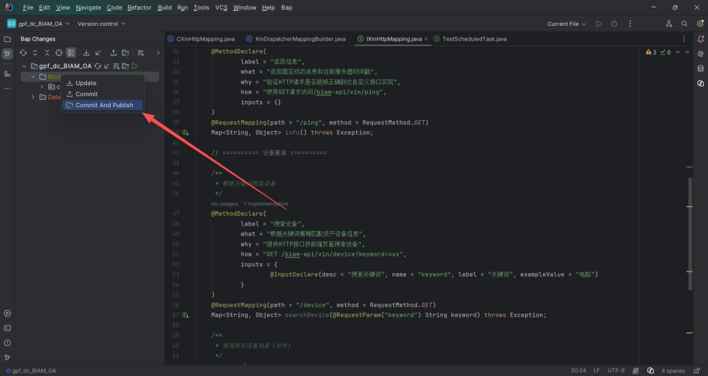
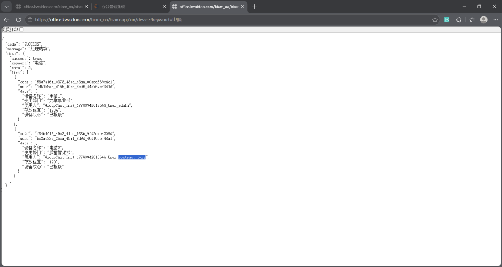

# HTTP 接口操作指南

以 http2 文件夹为例 | 6 步搞定

# 步骤一：进入自己的开发环境


## 操作

- 打开平台，登录进入自己的工作环境
- 确认当前页面为开发环境主页


# 步骤二：创建项目结构


## 操作

- 在 src/core/cell/biam/oa/ 下创建 http2 文件夹及子目录
- 最终结构如下：
```java
src/core/cell/biam/oa/
```
└── http2/
```java
    ├── IXinHttpMapping.java              ← 接口定义文件
    ├── impl/
    │   └── CXinHttpMapping.java          ← 接口实现文件
    └── dispatcher/
        └── XinDispatcherMappingBuilder.java  ← 分发器文件
```

# 步骤三：定义接口 IXinHttpMapping


## 操作

- 在 http2/ 下新建 IXinHttpMapping.java
- 编写接口代码，声明 HTTP 端点：
IXinHttpMapping.java
```java
package cell.biam.oa.http2;
import cell.CellIntf;
import cmn.anotation.ClassDeclare;
import cmn.anotation.InputDeclare;
import cmn.anotation.MethodDeclare;
import cmn.http.anotation.RequestMapping;
import cmn.http.anotation.RequestMethod;
import cmn.http.anotation.RequestParam;
import cmn.http.servlet.mapping.RequestMappingIntf;
import java.util.Map;
```
/**
 * Xin HTTP 接口。
 *
 * <p>提供简单的信息返回接口。</p>
 */
```java
@ClassDeclare(
        label = "BIAM Xin HTTP接口",
        what = "提供用于学习GPF HTTP请求映射的 Xin 接口",
        why = "验证接口定义、实现类和分发器三件套是否能够正常工作",
        how = "通过GET请求访问/biam-api/xin/info",
        developer = "开发者",
        createTime = "2026-07-24",
        updateTime = "2026-07-24",
        version = "1.0"
```
)
```java
@RequestMapping(path = "/biam-api/xin")
public interface IXinHttpMapping extends CellIntf, RequestMappingIntf {
    @MethodDeclare(
            label = "返回信息",
            what = "返回固定成功消息和当前服务器时间戳",
            why = "验证HTTP请求是否能够正确到达自定义接口实现",
            how = "使用GET请求访问/biam-api/xin/ping",
            inputs = {}
    )
    @RequestMapping(path = "/ping", method = RequestMethod.GET)
    Map<String, Object> info() throws Exception;
    // ========== 设备查询 ==========
    /**
     * 根据关键词搜索设备
     */
    @MethodDeclare(
            label = "搜索设备",
            what = "根据关键词模糊匹配资产设备信息",
            why = "提供HTTP接口供前端页面搜索设备",
            how = "GET /biam-api/xin/device?keyword=xxx",
            inputs = {
                    @InputDeclare(desc = "搜索关键词", name = "keyword", label = "关键词", exampleValue = "电脑")
            }
    )
    @RequestMapping(path = "/device", method = RequestMethod.GET)
    Map<String, Object> searchDevice(@RequestParam("keyword") String keyword) throws Exception;
    /**
     * 查询所有设备列表（分页）
     */
    @MethodDeclare(
            label = "设备列表",
            what = "分页查询资产设备列表",
            why = "提供HTTP接口供前端页面展示设备列表",
            how = "GET /biam-api/xin/devices?page=1&size=10",
            inputs = {
                    @InputDeclare(desc = "页码，从1开始", name = "page", label = "页码", exampleValue = "1"),
                    @InputDeclare(desc = "每页数量", name = "size", label = "每页数量", exampleValue = "10")
            }
    )
    @RequestMapping(path = "/devices", method = RequestMethod.GET)
    Map<String, Object> listDevices(@RequestParam("page") int page,
                                    @RequestParam("size") int size) throws Exception;
```
}

# 步骤四：实现接口 CXinHttpMapping


## 操作

- 在 http2/impl/ 下新建 CXinHttpMapping.java
- extends BasicCell_RequestMapping 并实现 IXinHttpMapping
CXinHttpMapping.java
```java
package cell.biam.oa.http2.impl;
import cell.biam.oa.expr.EquipmentTransferExpr;
import cell.biam.oa.http2.IXinHttpMapping;
import cell.cdao.IDao;
import cell.cdao.IDaoService;
import cell.gpf.adur.data.IFormMgr;
import cmn.anotation.ClassDeclare;
import cmn.http.cells.BasicCell_RequestMapping;
import gpf.adur.data.AssociationData;
import gpf.adur.data.Form;
import gpf.adur.data.ResultSet;
import org.nutz.dao.Cnd;
import java.util.ArrayList;
import java.util.LinkedHashMap;
import java.util.List;
import java.util.Map;
```
/**
 * Xin HTTP 接口实现类。
 */
```java
@ClassDeclare(
        label = "BIAM Xin HTTP接口实现",
        what = "实现 Xin HTTP 信息返回接口",
        why = "返回无数据库依赖的固定结果",
        how = "由HTTP框架根据IXinHttpMapping自动调用",
        developer = "开发者",
        createTime = "2026-07-24",
        updateTime = "2026-07-24",
        version = "1.0"
```
)
```java
public class CXinHttpMapping extends BasicCell_RequestMapping
        implements IXinHttpMapping {
    private static final long serialVersionUID = 1L;
    // ========== 原有方法 ==========
    @Override
    public Map<String, Object> info() throws Exception {
        Map<String, Object> result = new LinkedHashMap<>();
        result.put("message", "Xin 庞宇新，你真帅");
        result.put("timestamp", System.currentTimeMillis());
        result.put("path", "/biam-api/xin/ping");
        return result;
    }
    // ========== 设备查询方法 ==========
    @Override
    public Map<String, Object> searchDevice(String keyword) throws Exception {
        Map<String, Object> result = new LinkedHashMap<>();
        if (keyword == null || keyword.trim().isEmpty()) {
            result.put("success", false);
            result.put("message", "关键词不能为空");
            return result;
        }
        try (IDao dao = IDaoService.newIDao()) {
            String kw = "%" + keyword.trim() + "%";
            IFormMgr formMgr = IFormMgr.get();
            //  获取字段编码
            String field_设备名称 = formMgr.getFieldCode("设备名称");
            //  用 Cnd 在数据库层面做模糊匹配
            Cnd cnd = Cnd.where(field_设备名称, "like", kw);
            ResultSet<Form> rs = formMgr.queryFormPage(
                    dao, EquipmentTransferExpr.FORM_MODEL_ASSET,
                    cnd, 1, Integer.MAX_VALUE, true, true
            );
            List<Map<String, Object>> matched = new ArrayList<>();
            for (Form form : rs.getDataList()) {
                Map<String, Object> item = new LinkedHashMap<>();
                item.put("code", form.getAttrValue("Code"));
                item.put("uuid", form.getUuid());
                item.put("data", buildFormData(form));
                matched.add(item);
            }
            result.put("success", true);
            result.put("keyword", keyword);
            result.put("total", matched.size());
            result.put("list", matched);
        } catch (Exception e) {
            result.put("success", false);
            result.put("message", "查询失败：" + e.getMessage());
        }
        return result;
    }
    @Override
    public Map<String, Object> listDevices(int page, int size) throws Exception {
        Map<String, Object> result = new LinkedHashMap<>();
        if (page < 1) page = 1;
        if (size < 1 || size > 100) size = 10;
        try (IDao dao = IDaoService.newIDao()) {
            ResultSet<Form> rs = IFormMgr.get().queryFormPage(
                    dao, EquipmentTransferExpr.FORM_MODEL_ASSET,
                    null, 1, Integer.MAX_VALUE, true, true
            );
            List<Form> allForms = (rs != null && rs.getDataList() != null) ? rs.getDataList() : new ArrayList<>();
            // 手动分页
            int total = allForms.size();
            int fromIndex = (page - 1) * size;
            int toIndex = Math.min(fromIndex + size, total);
            List<Map<String, Object>> list = new ArrayList<>();
            if (fromIndex < total) {
                for (int i = fromIndex; i < toIndex; i++) {
                    Form form = allForms.get(i);
                    Map<String, Object> item = new LinkedHashMap<>();
                    item.put("code", form.getAttrValue("Code"));
                    item.put("uuid", form.getUuid());
                    item.put("data", buildFormData(form));
                    list.add(item);
                }
            }
            result.put("success", true);
            result.put("total", total);
            result.put("page", page);
            result.put("size", size);
            result.put("pages", (total + size - 1) / size);
            result.put("list", list);
        } catch (Exception e) {
            result.put("success", false);
            result.put("message", "查询失败：" + e.getMessage());
        }
        return result;
    }
    // ========== 工具方法 ==========
    /**
     * 判断表单是否匹配关键词（模糊匹配）
     */
    private boolean matchesKeyword(Form form, String keyword) {
        Map<String, Object> data = buildFormData(form);
        for (Object v : data.values()) {
            if (v != null && v.toString().toLowerCase().contains(keyword)) {
                return true;
            }
        }
        return false;
    }
    /**
     * 把表单关键字段读取为 Map（兼容文本字段和下拉框字段）
     */
    private Map<String, Object> buildFormData(Form form) {
        Map<String, Object> data = new LinkedHashMap<>();
        String[] fields = {
                EquipmentTransferExpr.FIELD_设备名称,
                EquipmentTransferExpr.FIELD_使用部门,
                EquipmentTransferExpr.FIELD_使用人,
                EquipmentTransferExpr.FIELD_存放位置,
                EquipmentTransferExpr.FIELD_设备状态
        };
        for (String field : fields) {
            try {
                Object value = form.getAttrValue(field);
                if (value == null) {
                    data.put(field, null);
                } else if (value instanceof AssociationData) {
                    data.put(field, ((AssociationData) value).getValue());
                } else {
                    data.put(field, value.toString());
                }
            } catch (Exception e) {
                data.put(field, null);
            }
        }
        return data;
    }
```
}

# 步骤五：创建分发器 XinDispatcherMappingBuilder


## 操作

- 在 http2/dispatcher/ 下新建 XinDispatcherMappingBuilder.java
- 实现 DispatcherMappingBuilder，配置请求拦截路径和响应处理器
XinDispatcherMappingBuilder.java
```java
package cell.biam.oa.http2.dispatcher;
import cmn.anotation.ClassDeclare;
import cmn.http.servlet.DispatcherMappingBuilder;
import cmn.http.servlet.HandlerInterceptor;
import cmn.http.servlet.HandlerMapping;
import cmn.http.servlet.HttpRequestHandler;
import cmn.http.servlet.HttpResponseHandler;
import cmn.http.servlet.impl.DefaultHandlerMapping;
import cmn.http.servlet.impl.DefaultHttpRequestHandler;
import cmn.http.servlet.impl.JsonHttpResponseHandler;
import java.util.ArrayList;
import java.util.List;
```
/**
 * Xin HTTP 请求分发器。
 *
 * <p>它决定哪些URL交给HTTP接口框架处理，并装配请求解析器、
 * JSON响应处理器和拦截器。</p>
 */
```java
@ClassDeclare(
        label = "BIAM Xin HTTP分发器",
        what = "为/biam-api/**路径装配默认请求处理器和JSON响应处理器",
        why = "让BIAM Xin接口能够被HTTP服务发现并调用",
        how = "发布云工程后将该DispatcherMappingBuilder装配到HTTP服务",
        developer = "开发者",
        createTime = "2026-07-24",
        updateTime = "2026-07-24",
        version = "1.0"
```
)
```java
public class XinDispatcherMappingBuilder implements DispatcherMappingBuilder {
    private static final long serialVersionUID = 1L;
    @Override
    public String[] getIncludePatterns() {
        return new String[]{"/biam-api/**"};
    }
    @Override
    public String[] getExcludePatterns() {
        return null;
    }
    @Override
    public HandlerMapping getHandlerMapping() {
        //请求处理器负责识别@RequestMapping并调用对应Java方法。
        HttpRequestHandler requestHandler = new DefaultHttpRequestHandler();
        //响应处理器负责将结果转换为JSON。
        HttpResponseHandler responseHandler = new JsonHttpResponseHandler();
        //拦截器列表
        List<HandlerInterceptor> interceptors = new ArrayList<>();
        //构造 HandlerMapping
        DefaultHandlerMapping handlerMapping = new DefaultHandlerMapping(
                getIncludePatterns(),
                getExcludePatterns(),
                requestHandler
        );
        //添加拦截器
        handlerMapping.setInterceptors(interceptors);
        //添加响应处理器
        handlerMapping.setRespHandler(responseHandler);
        return handlerMapping;
    }
```
}

# 步骤六：部署与验证


## 6.1 IDEA 提交 BAP Changes

- 在 IDEA 中右键项目根目录 → Commit And Publish（或先 Commit 再 Publish）



## 6.2 访问接口验证

- 发布成功后，通过浏览器或接口工具访问
- info 接口：http://服务器/biam-api/xin/ping
- searchDevice 接口：http://服务器/biam-api/xin/device?keyword=关键词
- listDevices 接口：http://服务器/biam-api/xin/devices?page=1&size=10


操作总结
- 进入自己的开发环境
- 创建项目结构（http2 / impl / dispatcher）
- 定义接口 IXinHttpMapping（@RequestMapping 声明端点）
- 实现接口 CXinHttpMapping（业务逻辑 + 数据库查询）
- 创建分发器 XinDispatcherMappingBuilder（/biam-api/** 拦截 + JSON 响应）
- IDEA Commit And Publish → 浏览器访问验证

---

## 附录：表格

| 本文档不讲概念，只讲操作。按步骤 1 → 6 顺序执行即可完成 HTTP 接口开发。每步配截图或代码，照着做就行。 |
| --- |

| 说明：IXinHttpMapping.java 是接口定义，CXinHttpMapping.java 是接口实现，XinDispatcherMappingBuilder.java 是请求分发器。 |
| --- |

| 关键：接口用 @ClassDeclare 声明类信息，类级 @RequestMapping(path = "/biam-api/xin") 定义前缀路径，方法用 @RequestMapping + @MethodDeclare 声明端点。 |
| --- |

| 代码要点： 1. info() 返回固定消息 + 时间戳（心跳测试） 2. searchDevice(keyword) 先做参数校验，再用 IDaoService.newIDao() + Cnd 模糊查询 3. listDevices(page, size) 全量查询后手动分页 4. buildFormData() 把表单字段读取为 Map，兼容 AssociationData 下拉框 5. 结果统一封装为 success / total / list 格式 |
| --- |

| 关键：@ClassDeclare 声明分发器信息。getIncludePatterns() 返回 /biam-api/** 拦截所有该路径请求。DefaultHttpRequestHandler 识别 @RequestMapping，JsonHttpResponseHandler 返回 JSON。 |
| --- |

| 成功标志：浏览器返回 JSON 数据（如 {"success": true, "total": 2, "list": [...]}），与代码中封装的数据结构一致即成功。 |
| --- |
