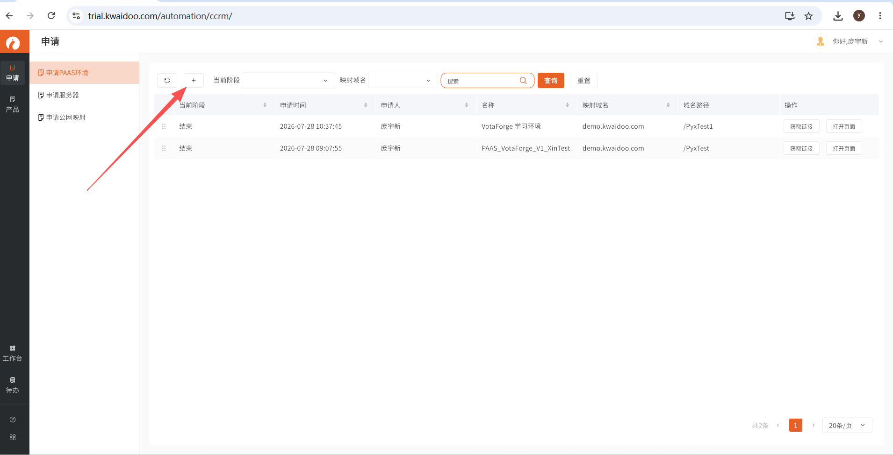
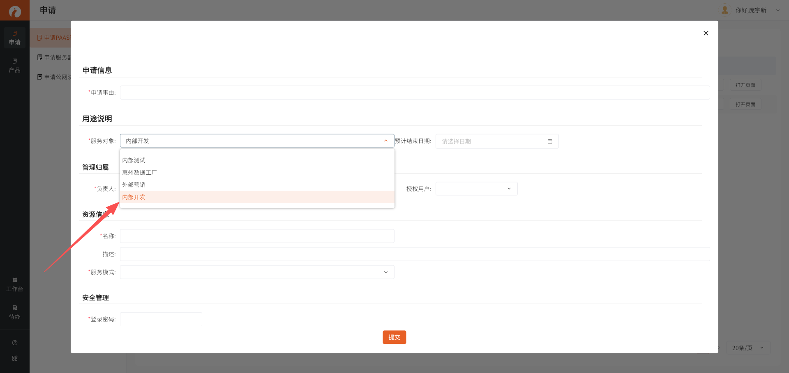
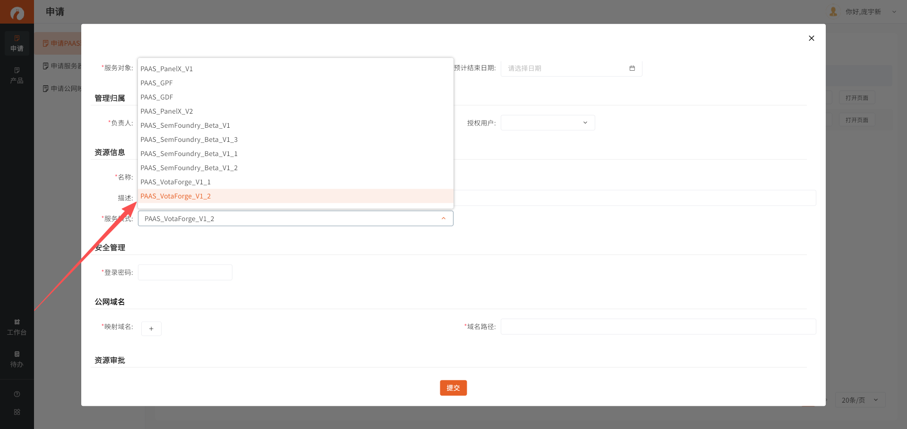
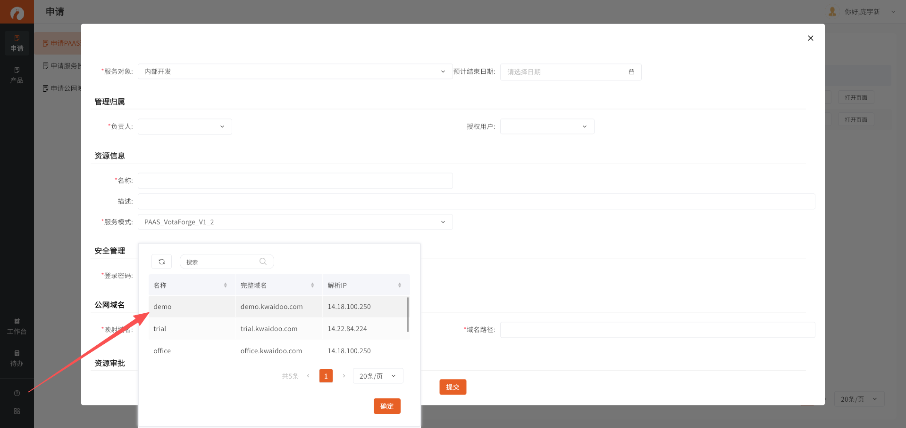
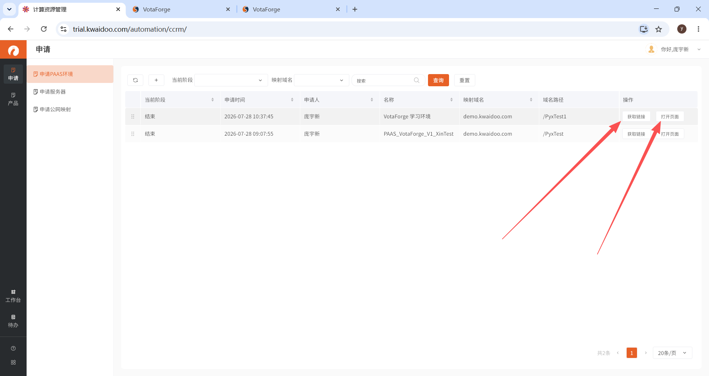
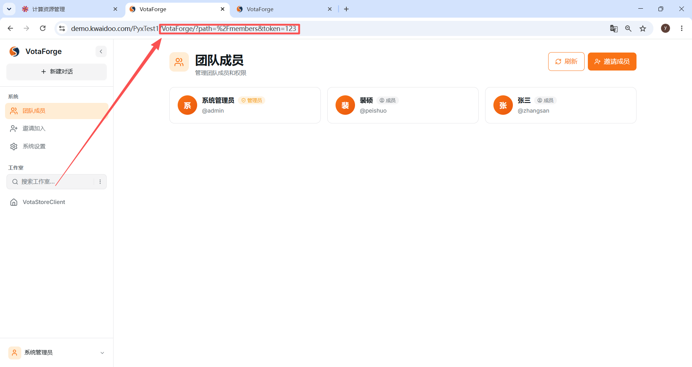

PAAS 环境申请操作指南
快速上手版 · 照着做就行
本文档不讲概念，只讲操作。按步骤 1 → 3 顺序执行即可完成环境申请。每步配截图，照着点就行。
步骤一：进入申请页面
操作
• 打开浏览器，访问 https://trial.kwaidoo.com/automation/ccrm/
• 登录后进入「申请 PAAS 环境」页面
• 点击页面左上角的「+」加号按钮，开始申请

图 1：进入申请页面，点击加号
步骤二：填写申请信息
2.1 服务对象
• 「服务对象」下拉框中选择「内部开发」

图 2：服务对象选择「内部开发」
2.2 操作模式（服务版本）
• 「服务模式」下拉框中选择最新版本（如 PAAS_VotaForge_V1_2）
• 选择最新的即可，不用纠结版本号

图 3：操作模式选择最新版本
2.3 公网域名
• 「公网域名」下拉框中选择「demo」
• 映射域名：demo.kwaidoo.com

图 4：公网域名选择 demo
2.4 域名路径（重点！）
• 「域名路径」输入框中填写自定义路径
• ⚠️ 路径不能与已有路径冲突！
• 申请前先查看当前已有路径列表，避免重复
命名建议：使用自己名字缩写 + test，例如 /PyxTest、/ZhangSanTest。已有路径示例：/PyxTest1、/PyxTest 等。
提示：填写完所有必填项后，点击底部「提交」按钮。
步骤三：审核与访问
3.1 联系审核员
• 提交后等待审核员审批
• 主动联系审核员催促审批（加急可用）
3.2 审核通过后获取访问方式
• 审核通过后，在申请列表中找到自己的记录
• 点击「获取链接」或「打开页面」按钮

图 5：审核通过后获取链接或打开页面
3.3 进入环境
• 获取到链接后，在浏览器中打开
• 或者在已有链接后面追加路径进入：
/VotaForge/?path=%2Fmembers&token=123

图 6：在网址后面添加 /VotaForge/?path=%2Fmembers&token=123 即可进入
提示：成功标志：页面正常加载，显示团队成员或系统界面，即表示环境申请成功。
操作总结
• 申请页面 → https://trial.kwaidoo.com/automation/ccrm/
• 服务对象 → 内部开发
• 操作模式 → 选最新版本
• 公网域名 → demo
• 域名路径 → 名字缩写 + test（不冲突）
• 提交 → 联系审核员 → 通过 → 获取链接 → 追加 /VotaForge/?path=%2Fmembers&token=123 → 进入
