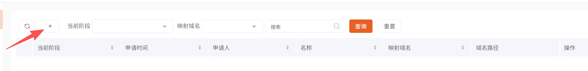
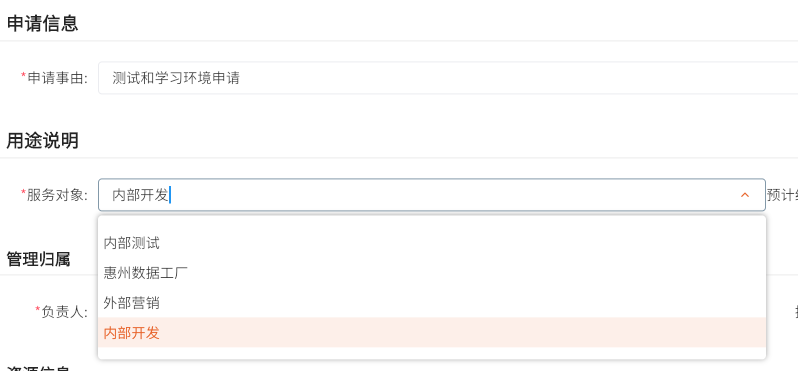
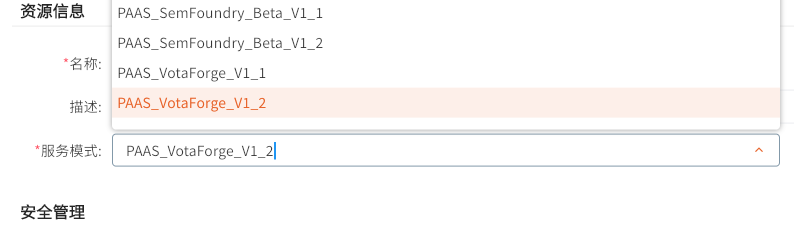
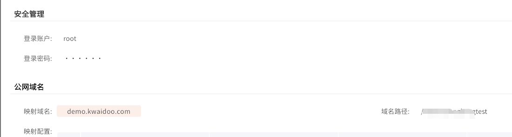
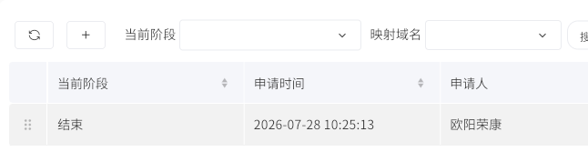
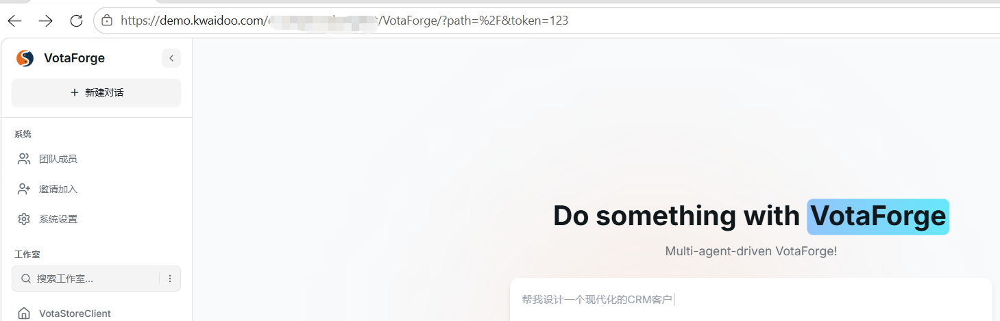

# 首先进入https://trial.kwaidoo.com/automation/ccrm/

（需要先获取自己的账号密码）

1. 登录进来后，点击左上角+号申请自己的环境

1. 点击进来的表单，选择内部开发。负责人选择自己的名字、

1. 在服务模式中选择PAAS\_VotaForge

1. 选择域名（映射域名选择demo），然后填写路径，一般是自己名字的拼音

1. 提交后，等待或者直接联系管理员审批申请，申请通过后，当前阶段会变为结束

1. **重点内容 ** 点击复制链接，这一步注意的是

复制的链接需要在后面加上/VotaForge/?path=%2F&token=123，然后才可以访问

踩坑点：复制的链接有时候会格式错误（kwaidoo.com后面），表现是出现2个//，这是错误的，需要自己删除一个/

