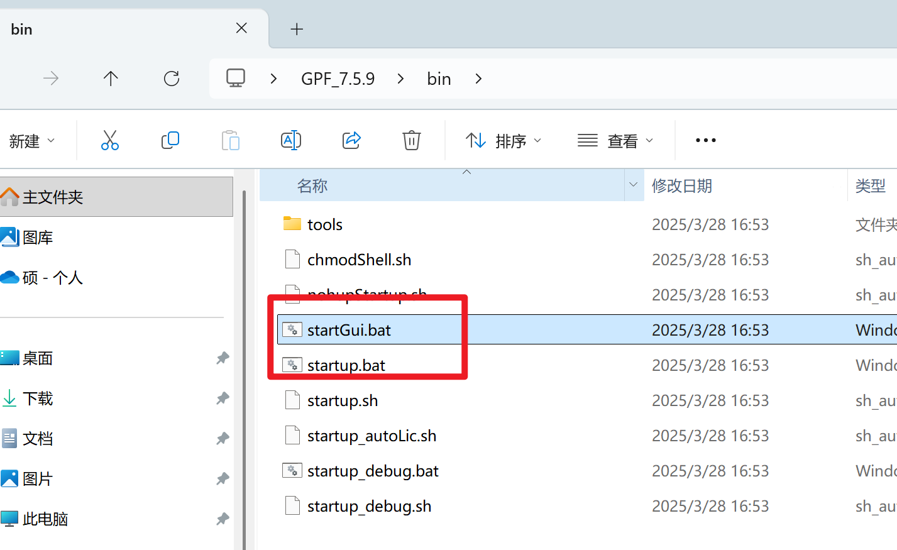
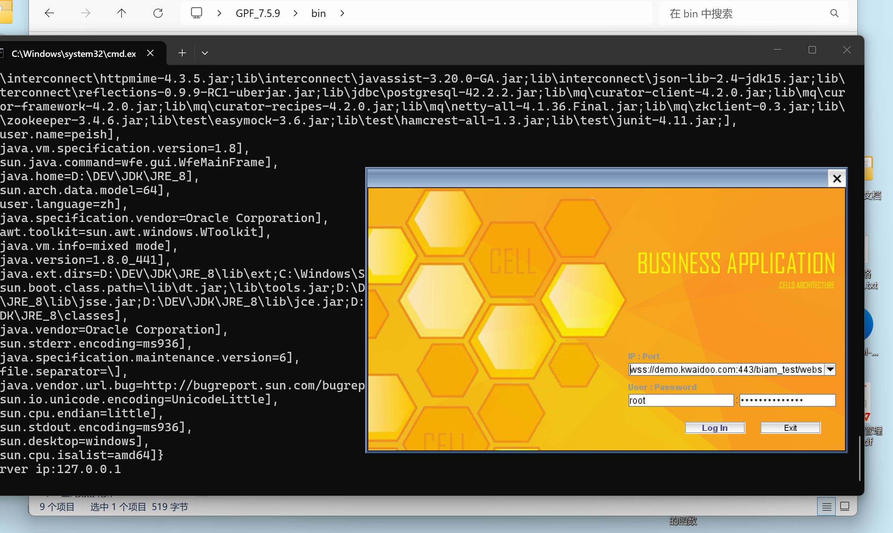
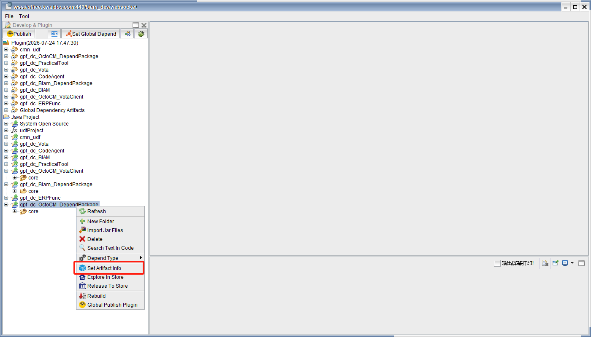
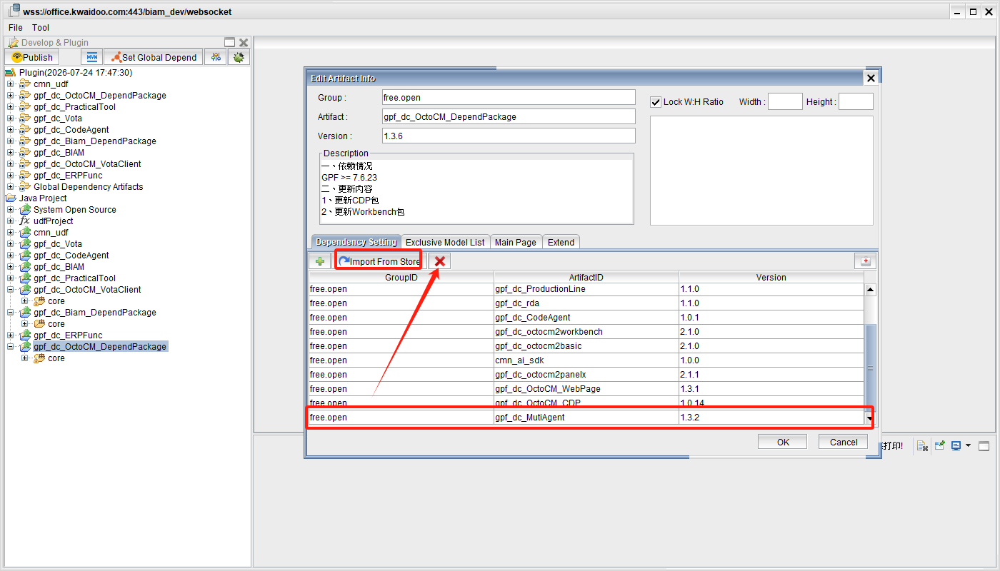
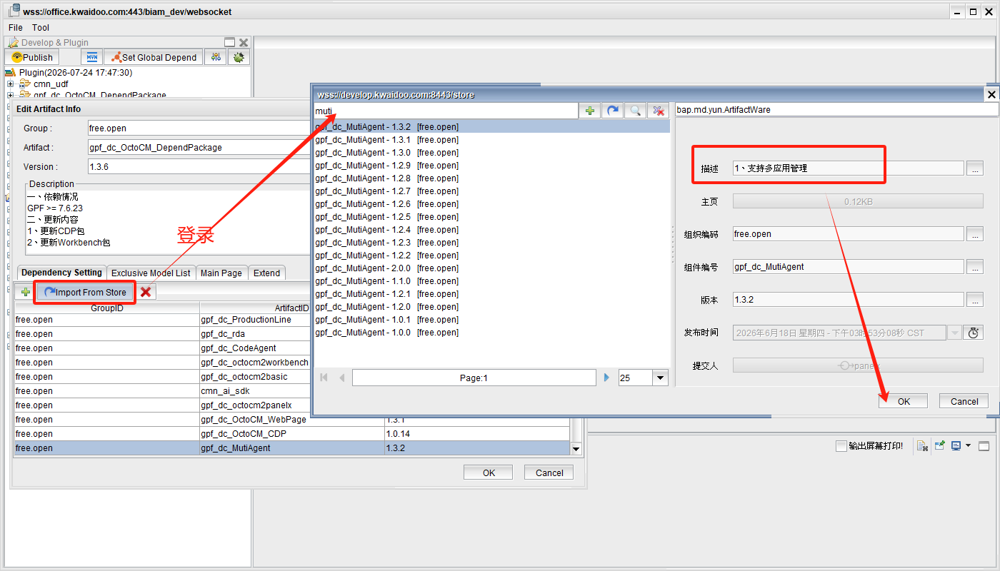
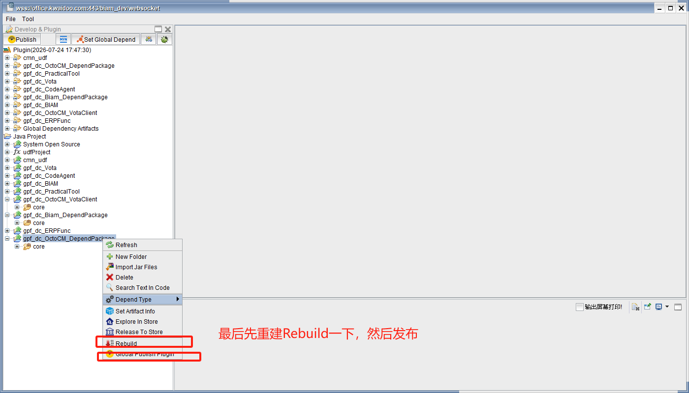
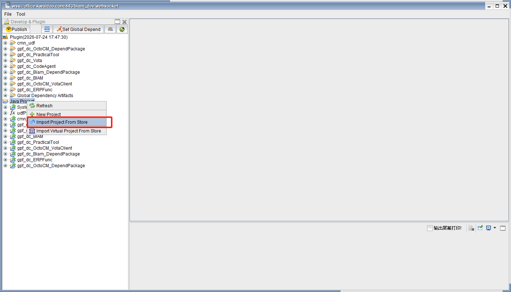
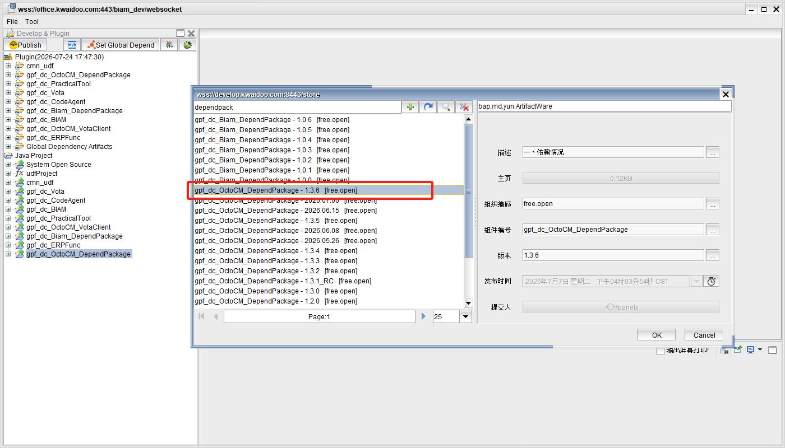
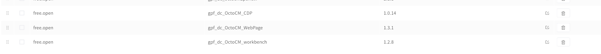

# VotaForge 前端和 MultiAgent 后端接口对接

以 GPF 客户端为例 | 4 步搞定

---

## 步骤一：下载 GPF 版本

### 操作

- 访问 GPF 版本下载页面：`http://14.18.100.250:8989/release/GPF/`
- 选择需要的版本进行下载（下载对应版本号的 `.zip` 压缩包）

---

## 步骤二：打开 GPF 客户端

### 操作

- 打开 GPF 客户端（可通过 BAP 插件「打开管理工具」进入）

---

## 步骤三：配置并登录

### 操作

- 在登录界面填写以下信息：

| 字段 | 值 |
|------|----|
| WS 地址 | `ws://14.18.100.250:18126/` |
| 用户名 | `panelx` |
| 密码 | `panelx123!@#` |

- 确认信息无误后，点击「连接」登录

---

## 步骤四：删除并拉取工程版本

### 操作

- 登录成功后，在 GPF 客户端中**先删除需要更新的工程**
- 再从仓库**拉取需要的对应版本**

---

## 常见问题：进入工作室报错"应用不存在或系统错误"

对接完成后如果进入工作室时出现此错误，通常是 **GPF 插件版本不兼容** 导致的。

### 解决方案：依次更新并重建发布插件

需要按以下顺序更新插件版本：

| # | 插件名称 | 操作 |
|---|----------|------|
| 1 | `gpf_dc_OctoCM_DependPackage` | 导入版本 `1.3.6` |
| 2 | `gpf_dc_OctoCM_CDP` | 导入最新版本 |
| 3 | `gpf_dc_OctoCM_WebPage` | 导入最新版本 |
| 4 | `gpf_dc_OctoCM_workbench` | 导入最新版本 |

### 更新步骤

#### 1. 更新 DependPackage

- 在左侧 **Java Project** 区域点击右键
- 选择 **Import Project From Store**
- 在弹出框中搜索并选择 `gpf_dc_OctoCM_DependPackage`，版本选择 **1.3.6**
- 点击 **OK** 确认导入

#### 2. 更新 CDP、WebPage、workbench

重复以上导入操作，分别导入：
- `gpf_dc_OctoCM_CDP`
- `gpf_dc_OctoCM_WebPage`
- `gpf_dc_OctoCM_workbench`

均选择最新版本。

#### 3. 重建并发布

对每个更新的插件，右键点击该插件，在菜单中选择：

| 操作 | 说明 |
|------|------|
| **Rebuild** | 重新编译构建该插件 |
| **Release To Store** | 将构建好的插件发布到商店 |

发布顺序与更新顺序一致：DependPackage → CDP → WebPage → workbench

---

## 操作总结

| # | 操作 | 说明 |
|---|------|------|
| 1 | 下载 GPF 版本 | 访问 `http://14.18.100.250:8989/release/GPF/` 下载对应版本 `.zip` |
| 2 | 打开 GPF 客户端 | BAP 插件 → 打开管理工具 |
| 3 | 填写登录信息 | WS: `ws://14.18.100.250:18126/`，用户: `panelx`，密码: `panelx123!@#` |
| 4 | 删除旧工程并拉取新版本 | 在 GPF 客户端中完成版本更新 |
| 5 | 如遇工作室报错 | 按顺序更新 DependPackage(1.3.6) → CDP → WebPage → workbench，然后 Rebuild + Release To Store |
