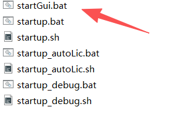
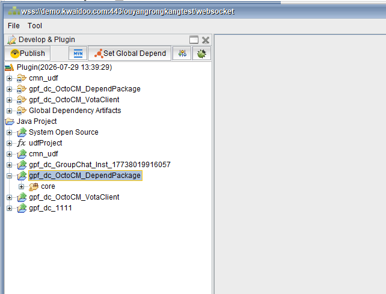
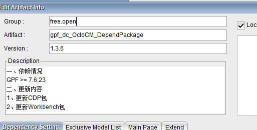
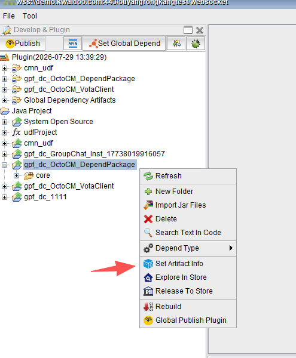
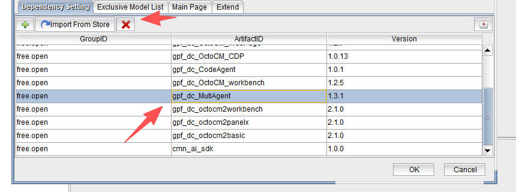
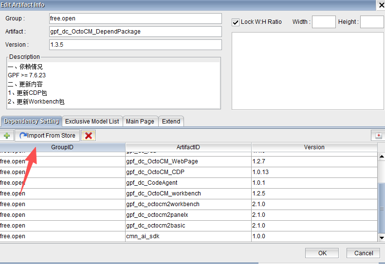
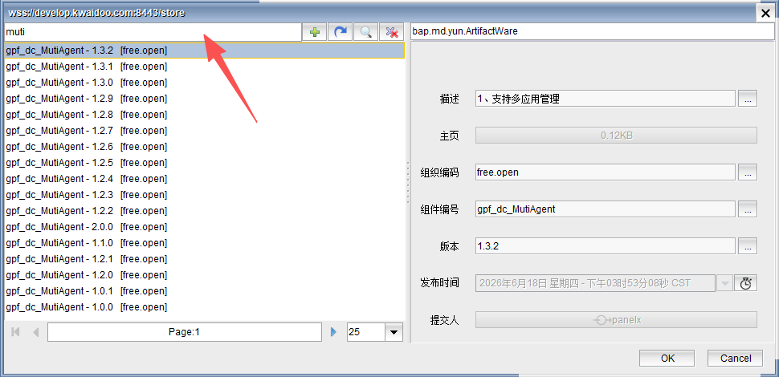

# VotaForge 前端和 MultiAgent 后端接口对接

本文记录 VotaForge 前端与 MultiAgent 后端接口对接前，需要更新的 GPF 平台包和相关组件。

## 适用场景

当本地或测试环境中的 GPF 平台包、CDP、WebPage、workbench 或 MultiAgent 版本较旧时，需要先完成组件更新，再继续做前后端接口联调。

## 准备工作

1. 获取对应环境的访问地址、账号和密码。
2. 确认本地已准备 GPF 平台包。
3. 使用 JDK 8 启动平台。当前启动脚本默认依赖 JDK 8。
4. 不要把真实账号、密码或生产环境 WebSocket 地址提交到公开仓库。文档中建议统一使用占位符。

## 更新平台包

### 1. 启动平台

进入 GPF 平台包的 `bin` 目录，打开启动脚本。



启动后输入对应环境的账号和密码。

连接信息格式一般如下：

```text
wss://<host>/<path>/websocket
密码：<管理员提供的密码>
```



进入平台后，打开工程包更新入口。


### 2. 更新整体工程包

在版本列表中搜索 `1.3.6` 或更新版本，选择目标版本后执行整体更新，并重新构建。



## 更新组件

整体工程包更新完成后，进入组件更新页面。



先删除旧组件。



然后点击 `import`，进入组件导入登录页面。账号和密码向管理员获取。



登录后选择最新版本。



## 需要更新的组件

本次至少需要更新以下 4 个组件：

| 组件名 | 说明 |
| --- | --- |
| `gpf_dc_OctoCM_CDP` | CDP 相关组件 |
| `gpf_dc_OctoCM_WebPage` | WebPage 页面能力组件 |
| `gpf_dc_OctoCM_workbench` | workbench 相关组件 |
| `MultiAgent` | MultiAgent 后端相关组件 |

搜索上述组件，并分别更新到最新版本。

## 检查结果

更新完成后，建议检查以下内容：

1. 平台能正常启动。
2. 组件列表中可以看到更新后的版本。
3. VotaForge 前端页面可以正常打开。
4. MultiAgent 后端接口调用不再因为组件版本过旧而失败。
