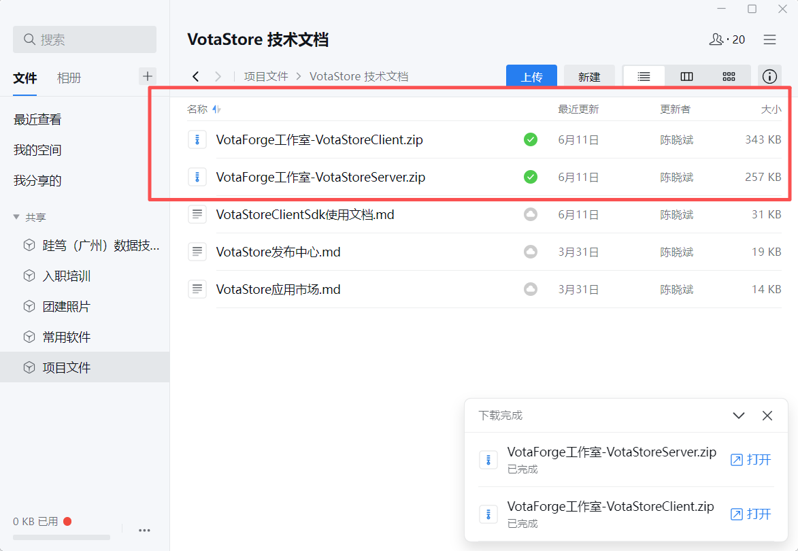
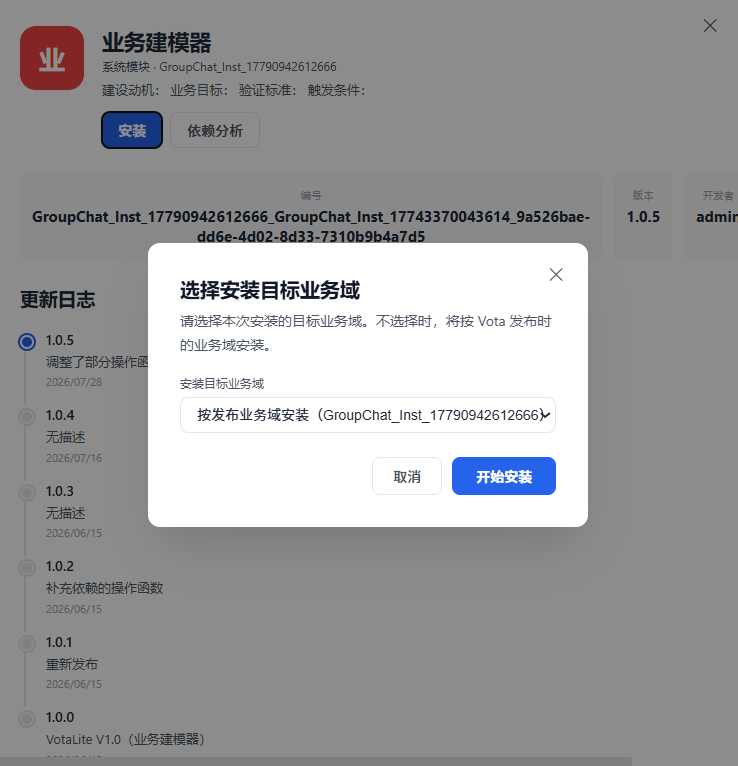
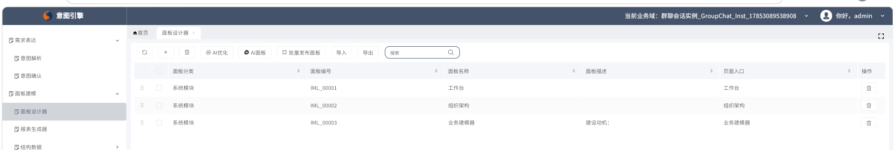
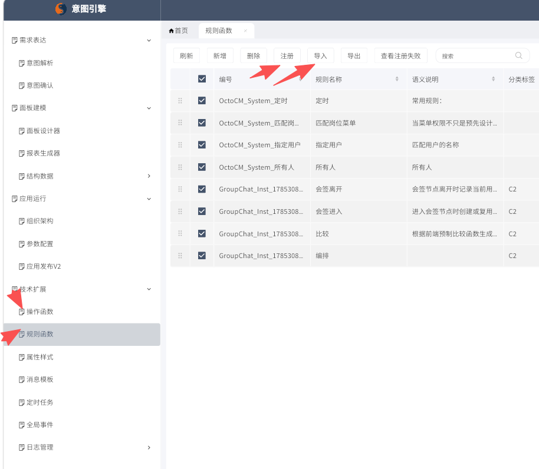

# VotaLite 安装说明

本文记录 VotaLite 的安装流程，以及安装后导入操作函数和规则函数的基本步骤。

## 访问地址

先进入 VotaStore 客户端地址：

```text
https://demo.kwaidoo.com/ouyangrongkangtest/CDP/app/VotaStoreClient/
```

## 下载安装包

在企业微信微盘中下载 VotaLite 安装所需文件。



## 安装业务建模器

进入 VotaStore，将业务建模器安装到需要使用的目标面板。




## 打开业务建模器

安装完成后，分别进入以下页面：

1. 意图引擎：`https://demo.kwaidoo.com/ouyangrongkangtest/PanelXPro/`
2. 已安装业务建模器的目标面板

在目标面板中点击“发业务建模器”。



## 导入函数

进入业务建模器后，点击导入操作函数与规则函数。



导入完成后，注册对应函数。注册后建议检查函数列表，确认操作函数和规则函数都能被当前业务域正常识别。

## 检查结果

安装完成后，建议确认以下内容：

1. 业务建模器已经安装到目标面板。
2. 意图引擎页面可以正常打开。
3. 操作函数和规则函数已导入。
4. 函数注册后，在流程配置或按钮动作中可以正常调用。
