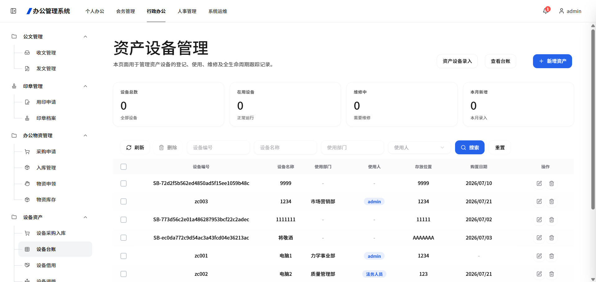
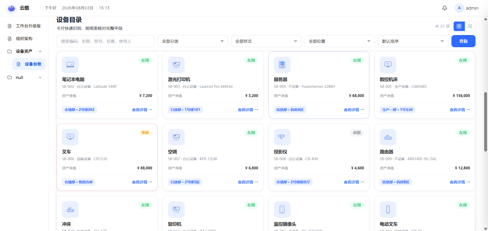
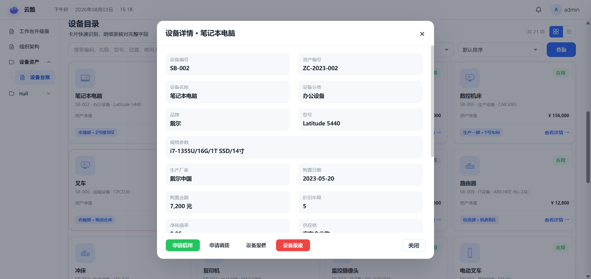
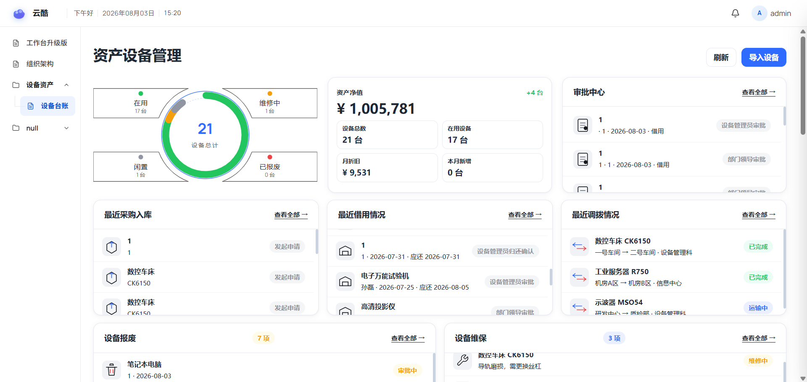

# 如何配置用户友好界面
## 快速上手版 · 照着做就行

> ⚠️ **重要提醒：修改系统原本内容时，最好参照原内容的功能进行修改**

本文档介绍如何将系统默认的简陋界面优化为对用户更加友好的展示方式。以"设备管理"为例，讲解如何通过卡片形式、详情弹窗、KPI看板等手段提升用户体验。

---

## 一、设计思路

在开始优化之前，我们需要思考以下问题：

- **用户想要什么？** — 用户希望快速了解设备状态、一眼看到关键信息
- **用户嫌什么麻烦？** — 用户不想在密密麻麻的表格里找信息
- **我们该怎么实现？** — 用卡片代替表格、增加状态标识、添加KPI看板

---

## 二、原始界面分析

### 原本的设备台账

系统默认的设备台账只有**表格 + 表单**，信息展示方式单一：

- 设备信息以行列表格展示
- 数据密密麻麻，不够直观
- 需要逐行查看才能了解设备状态
- 缺少可视化概览

图1：原本的设备台账

---

## 三、优化步骤

### 步骤一：采用卡片形式展示设备

将原本的表格视图改为**卡片网格视图**，使设备信息更易吸收和识别：

**卡片视图的优势：**
- 每个设备独立展示，信息一目了然
- 状态标签（绿色"在用"、灰色"闲置"、橙色"维修"）清晰可见
- 设备类型图标帮助快速分类识别
- 包含设备编码、分类、型号、金额等关键信息

图2：卡片视图展示设备

### 步骤二：添加设备详情弹窗

点击卡片上的"查看详情"，弹出设备详细信息：

**详情弹窗包含：**
- 设备基本信息（编号、名称、分类、品牌、型号）
- 规格参数
- 购置日期、金额、折旧信息
- 操作按钮（申请借用、申请调拨、设备报修、设备报废）

图3：设备详情弹窗

### 步骤三：优化KPI看板

将设备管理的内容元素整合到首页或看板中，增加相关流程管理：

**优化后的KPI看板包含：**
- **设备状态环形图**：直观展示设备总量及在用/闲置/维修/报废状态分布
- **资产净值与核心指标**：设备总数、在用设备、月折旧、本月新增
- **审批中心**：待处理的借用/调拨/报废审批
- **业务动态列表**：
  - 最近采购入库
  - 最近借用情况
  - 最近调拨情况
- **业务管理入口**：
  - 设备报废（审批中列表）
  - 设备维保（维修中设备及故障原因）

图4：优化后的KPI看板

---

## 操作总结

### 用户友好界面优化思路
1. **分析用户需求** — 用户想要什么？用户嫌什么麻烦？
2. **改进信息展示方式** — 用卡片代替表格，状态一目了然
3. **增加详情查看** — 点击卡片弹出详细信息，不占主界面空间
4. **整合流程管理** — 把相关的业务流程（采购、借用、调拨、维保）整合到一个页面
5. **可视化数据** — 用环形图、数据看板等形式展示统计信息

### 关键要点
- **卡片视图**：让用户快速识别设备状态
- **详情弹窗**：保留表格的详细信息，同时保持界面简洁
- **KPI看板**：一屏掌握设备总量、资产价值、待办审批
