# 定制化内容
## 快速上手版 · 照着做就行

> ⚠️ **重要提醒：修改系统原本内容时，最好参照原内容的功能进行修改**

本文档介绍如何在 VotaForge 平台上进行定制化配置，包括：自定义首页、菜单权限配置、定制登录页。按步骤操作即可完成。

---

## 一、如何配置自定义首页（让首页更漂亮）

### 步骤一：进入工作室

- 打开自己的环境，进入 **VotaForge 管理后台**
- 点击要配置的工作室，点击右上角 **"进入工作室"** 按钮

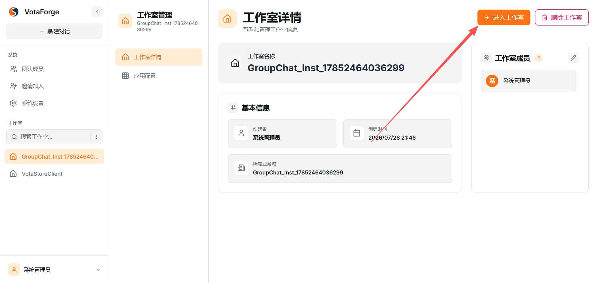

图1：进入工作室

### 步骤二：找到首页的视图编排

- 在工作室左侧找到 **"交付物列表"**
- 找到 **"首页"** 这个交付物，点击下方的 **"视图编排"** 按钮

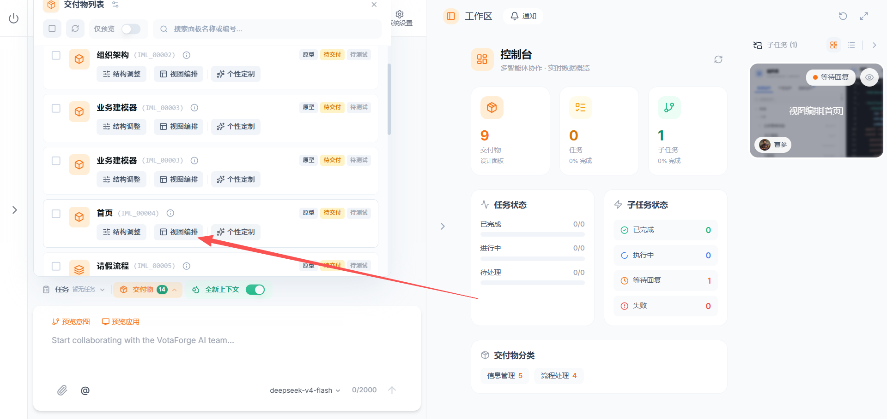

图2：点击视图编排

### 步骤三：替换首页代码

- 在视图编排界面中，找到右侧的 **"自定义HTML"** 组件
- 在代码编辑器的 **HTML 模板** 标签页中，把系统默认的代码替换为自己编写的首页代码
- 点击 **"保存"** 按钮保存代码

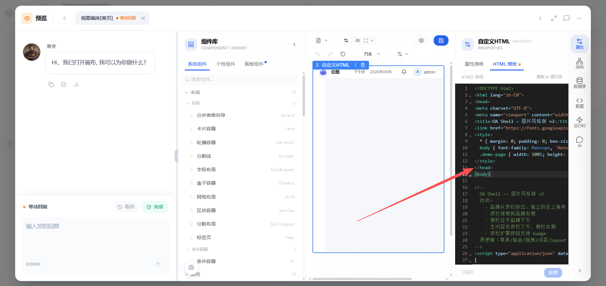

图3：替换HTML代码

### 步骤四：预览验证

- 返回工作室，点击右上角 **"预览应用"** 按钮
- 查看首页是否按预期显示自己编写的页面样式

---

## 二、如何让不同角色看到不同的菜单（菜单权限）

### 步骤一：进入权限配置

- 进入自己的环境，点击相应的工作室
- 点击 **"应用配置"** → **"权限配置"** 标签页

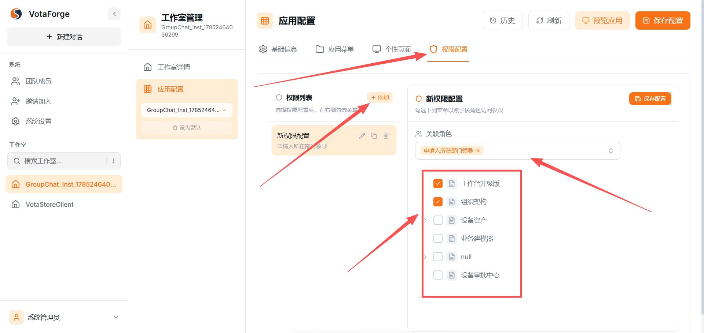

图4：权限配置界面

### 步骤二：添加权限配置

- 点击 **"+ 添加"** 按钮新建一个权限配置
- 在 **"关联角色"** 中选择需要配置权限的角色（如：申请人所在部门领导）
- 在下方的菜单列表中，勾选该角色可以访问的菜单项

### 步骤三：保存配置

- ⚠️ **记得点击右上角的 "保存配置" 按钮！**
- 配置不会自动保存，必须手动点击保存

### 步骤四：验证权限配置

用不同角色登录预览应用，查看菜单是否按配置显示：

**admin 登录效果：**

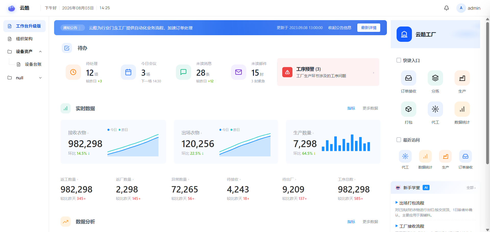

图5：admin登录工作台

**zhangsan 登录效果：**

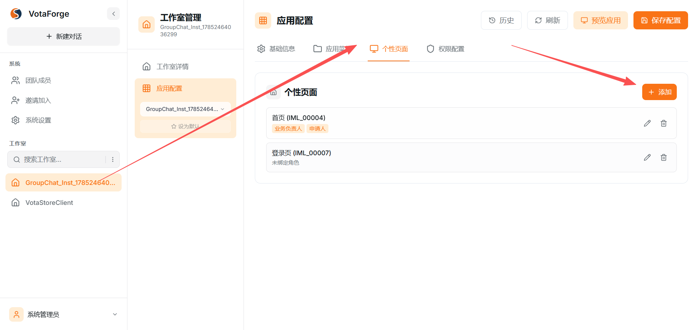

图6：zhangsan登录工作台

---

## 三、如何配置定制的登录页（而非CDP默认的）

### 步骤一：在预览应用中创建登录页表单

- 在预览应用中使用 **业务建模器** 创建一个登录页表单
- 设计表单字段（如：标题、说明等）
- 设计完成后，点击右上角 **"发布"** 按钮发布表单

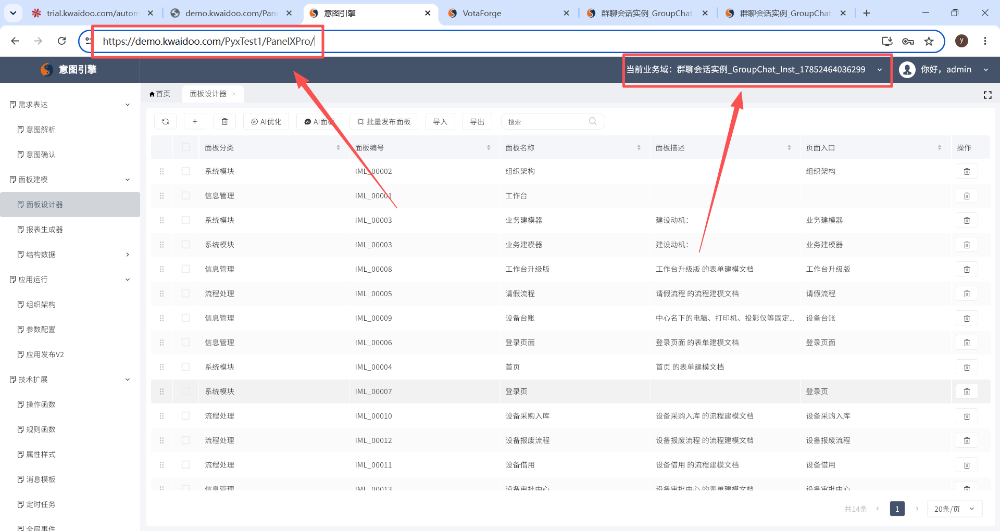

图8：业务建模器创建登录页

### 步骤二：进入个性页面添加登录页

- 点击相应的工作室
- 点击 **"应用配置"** → **"个性页面"** 标签页
- 点击 **"+ 添加"** 按钮

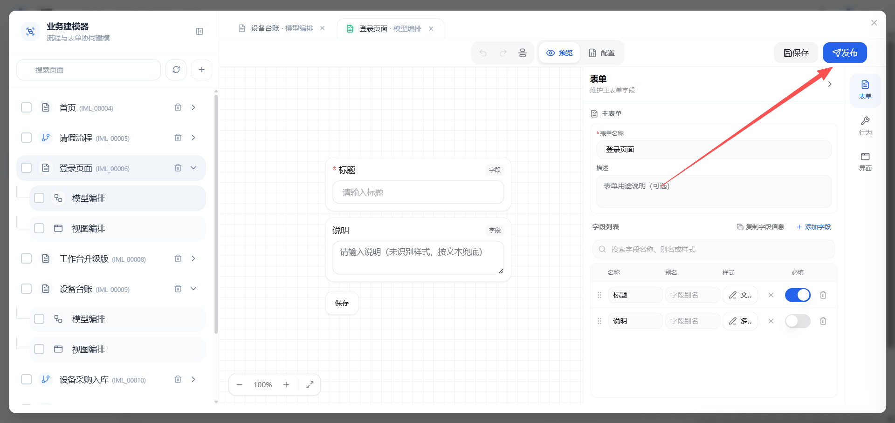

图7：个性页面添加按钮

### 步骤三：在 PanelXPro 中选择业务域

- 进入 **意图引擎** → **PanelXPro**
- 确认当前业务域是否为你的环境（如：群聊会话实例_GroupChat_Inst_xxx）

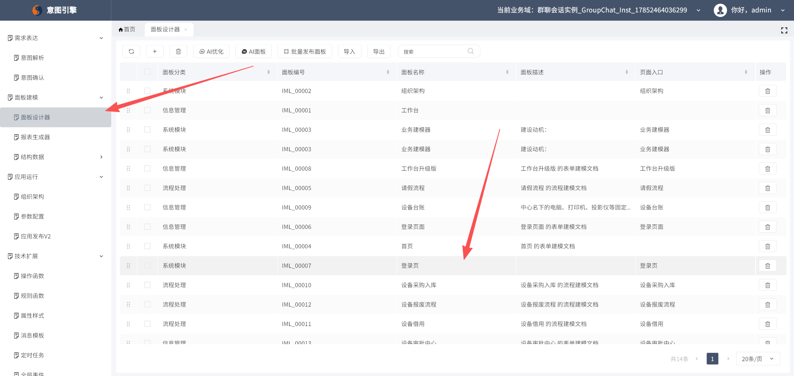

图9：PanelXPro 选择业务域

### 步骤四：进入面板设计器配置登录页

- 在意图引擎中点击 **"面板建模"** → **"面板设计器"**
- 在面板列表中找到 **"登录页"**（编号：IML_00007）
- 选择对应的业务域和面板

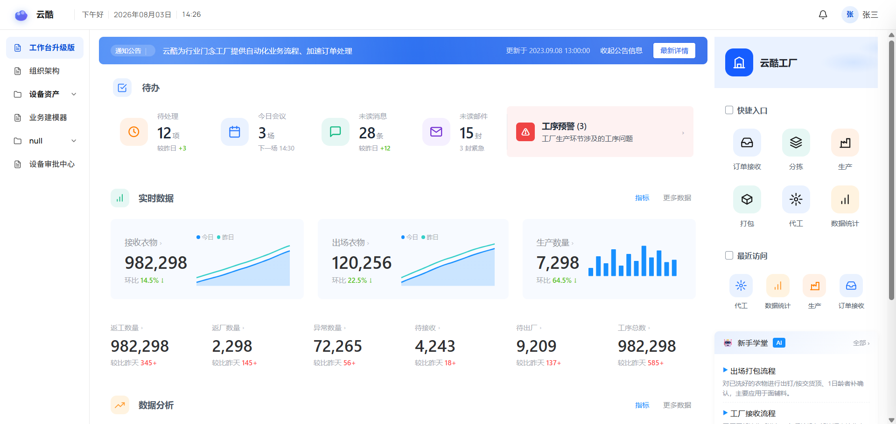

图10：面板设计器配置登录页

### 步骤五：选择页面编排并点击页面代码

- 在弹出的"面板设计器"窗口中，点击顶部 **"页面编排"** 标签页
- 在"面板网页"配置区域，找到"登录页"这一行
- 点击 **"页面代码"** 列中的内容（如 `<!DOCTYPE html>`）进入代码编辑

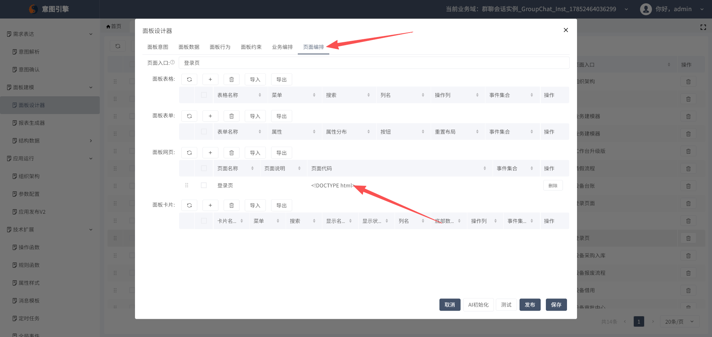

图11：页面编排界面

### 步骤六：复制粘贴自己的代码

- 在弹出的"面板设计器_自定义页面构面"编辑框中
- 找到 **"页面代码"** 编辑区域
- 把系统默认的 HTML 代码删除，粘贴上自己编写的登录页代码
- ⚠️ **建议先参考原本的代码**，了解完整的 CDP SDK 功能后再编写自定义代码

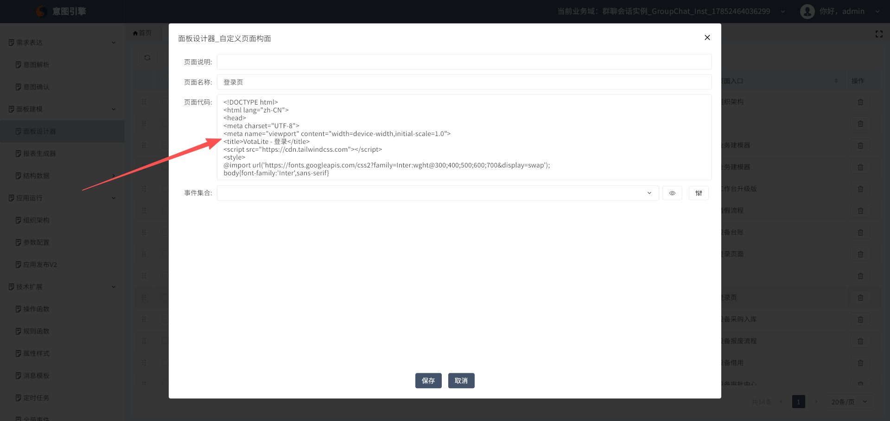

图12：页面代码编辑

### 步骤七：保存并发布

- 代码编辑完成后，点击编辑框底部的 **"保存"** 按钮保存代码

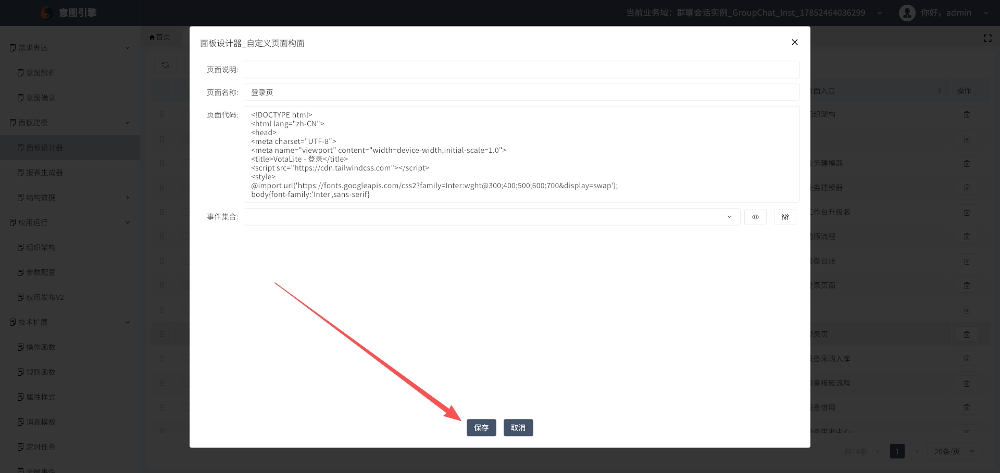

图13：保存按钮

- 返回"面板设计器"弹窗，点击底部的 **"发布"** 按钮发布页面

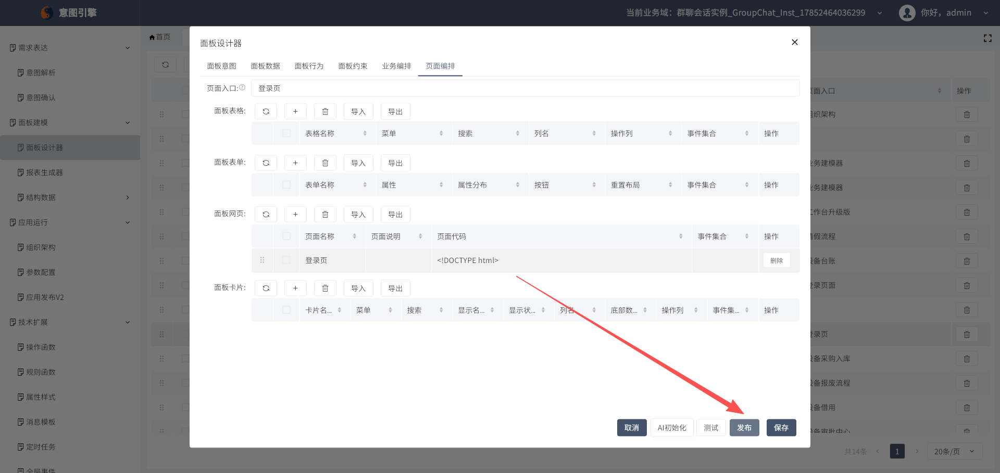

图14：发布按钮

### 步骤八：验证登录页效果

- 发布完成后，预览应用
- 查看登录页是否已更换为自己编写的自定义页面

### 步骤九：关联并验证（可选）

- 如需将创建的登录页表单与个性页面关联，可在 **"个性页面"** 中进行配置
- 预览应用，查看是否显示定制的登录页而非CDP默认页面

---

## 操作总结

### 一、配置自定义首页
1. 进入工作室 → 找到"首页"交付物 → 点击"视图编排"
2. 替换自定义HTML组件中的代码 → 保存
3. 预览应用验证效果

### 二、配置菜单权限
1. 进入工作室 → 应用配置 → 权限配置
2. 添加权限配置 → 选择角色 → 勾选菜单 → **保存配置**
3. 用不同角色登录预览验证

### 三、配置定制登录页
1. 在业务建模器中创建并发布登录页表单
2. 进入个性页面 → 点击添加
3. 在 PanelXPro 中确认业务域
4. 在面板设计器中找到登录页面板
5. 点击"页面编排" → 点击"页面代码"
6. 复制粘贴自定义登录页代码（参考原本代码了解CDP SDK）
7. **保存** → **发布**
8. 预览应用验证登录页效果
