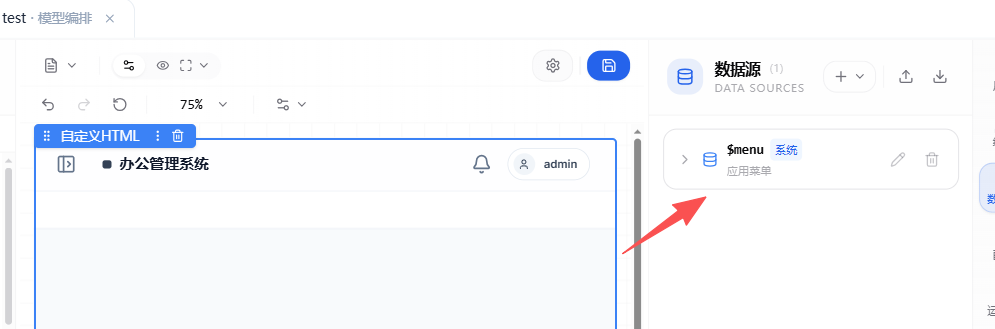
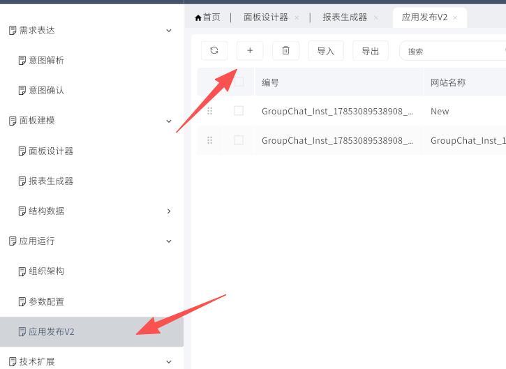
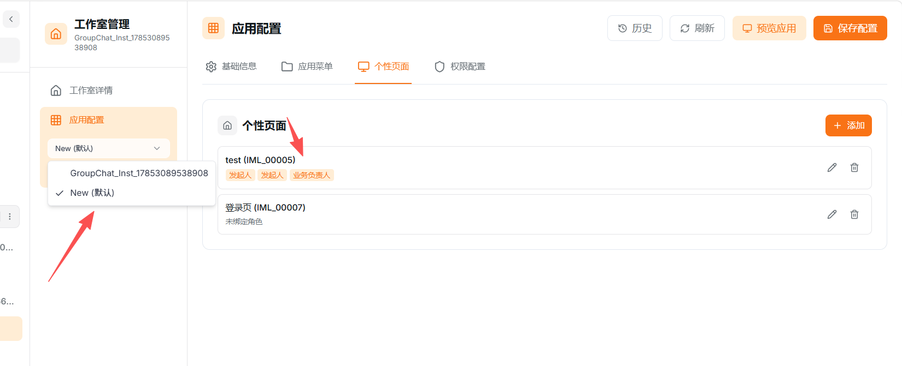
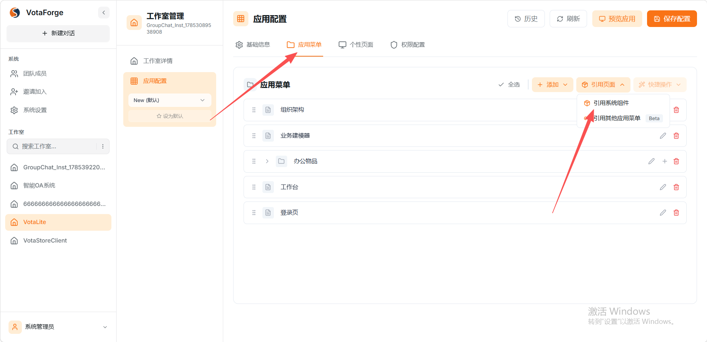
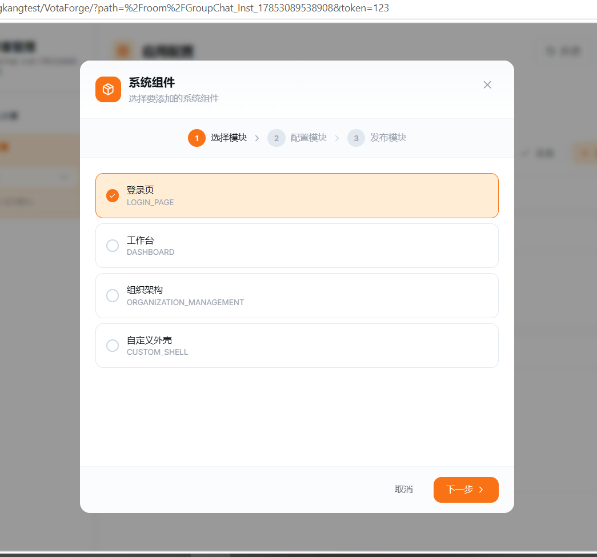
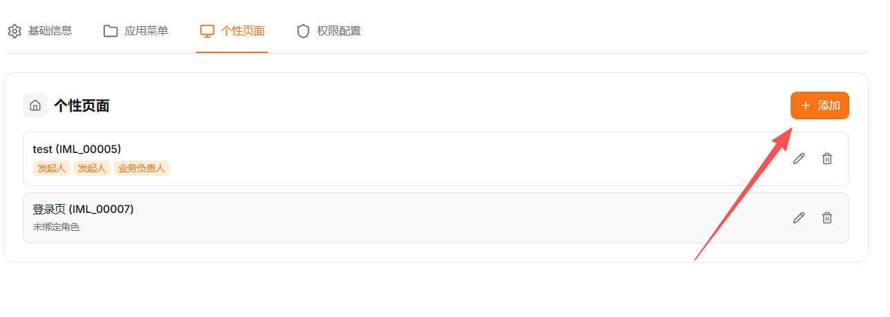
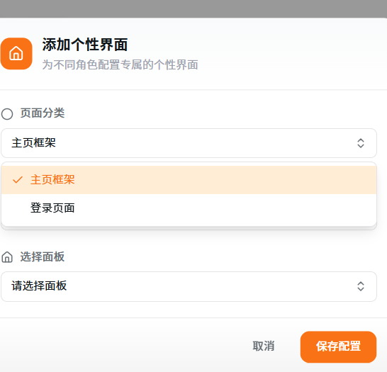
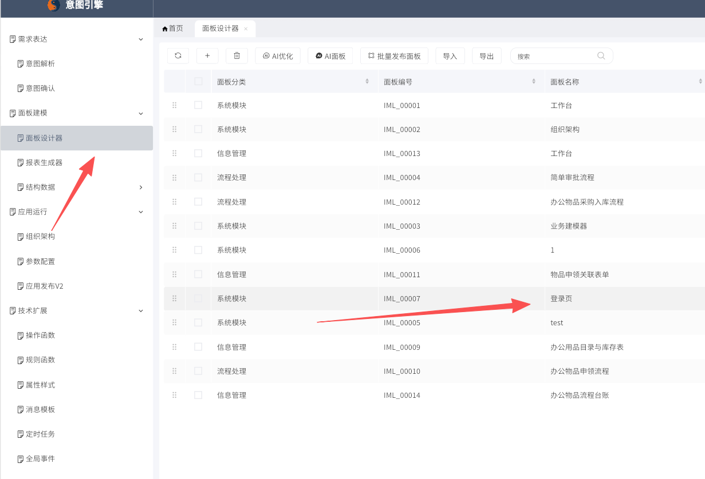
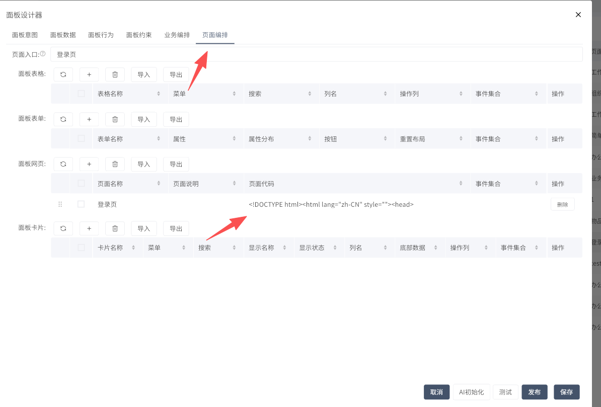
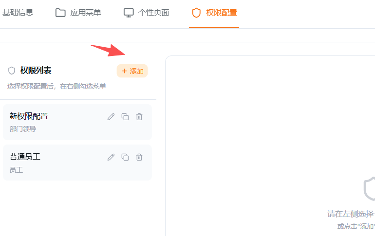

# 定制化内容

本文记录 VotaLite 中三个定制化配置内容：

- 自定义首页
- 自定义登录页
- 不同角色看到不同页面

## 一、自定义首页配置

### 第一步：准备首页框架页面

先在 VotaLite 中创建一个用于承载首页的页面。

建议页面名称：

```text
工作台
```

这个页面用于替代系统默认首页，后续用户进入应用后优先看到该页面。

### 第二步：在首页页面中添加 HTML

进入页面设计器，在【界面】中添加自定义 HTML 组件。

将首页框架 HTML 粘贴到 HTML 模板中。

注意：

- 首页框架主要负责整体布局、菜单展示和用户信息展示。
- 如果已有可用的首页框架代码，优先保留其中的数据读取逻辑，只调整样式。
- 不建议直接删除所有事件和数据绑定代码，否则菜单或用户信息可能无法显示。

### 第三步：添加系统数据源

在页面右侧添加系统数据源。

首页框架常用数据源：

| 数据源 | 作用 |
| --- | --- |
| `$menu` | 读取当前应用菜单 |
| `$user` | 读取当前登录用户 |
| `$appMeta` | 读取当前应用信息 |
| `$panelMeta` | 读取当前面板信息 |

其中 `$menu` 最关键，用于让首页框架识别当前应用下配置了哪些菜单。



### 第四步：保存并发布首页页面

配置完成后保存页面，并发布该页面。

发布后先进入预览页面检查：

1. 页面是否正常显示。
2. 菜单是否正常展示。
3. 当前用户是否正常显示。
4. 页面刷新后是否仍然正常。

### 第五步：在 PanelXPro 中新建应用

进入 `PanelXPro/`。

打开【应用发布 V2】，点击新增按钮，新建一个空应用。

该应用用于承载自定义首页框架和后续业务页面。



### 第六步：回到 VotaForge 选择新应用

回到 VotaForge 后，在应用配置区域可以看到新建的应用选项。

切换到该应用后，进入【个性页面】配置。



### 第七步：添加主页面框架

在【个性页面】中点击【添加】。

页面分类选择：

```text
主页面框架
```

然后选择前面创建好的工作台页面。

保存配置后，系统进入该应用时会优先加载这个自定义首页框架。

### 第八步：测试首页

点击【预览应用】测试。

重点检查：

1. 是否默认进入工作台。
2. 顶部菜单或侧边菜单是否显示正常。
3. 当前用户信息是否显示正常。
4. 点击菜单是否能切换到对应页面。
5. 页面刷新后是否还能正常进入。

## 二、自定义登录页配置

### 第一步：引用系统登录页

进入 VotaForge 的【应用配置】。

切换到【应用菜单】，点击【引用页面】，选择【引用系统组件】。



在系统组件中选择：

```text
登录页
```



选择完成后发布应用，系统会生成一个默认登录页。

### 第二步：添加登录页到个性页面

进入【个性页面】。

点击【添加】。



页面分类选择：

```text
登录页面
```

然后选择系统生成的登录页面板，保存配置。



### 第三步：进入 PanelXPro 找到登录页面板

进入 `PanelXPro/`。

打开【面板设计器】，找到登录页对应的面板。



### 第四步：替换登录页样式

点击登录页面板进入设计器。

切换到【页面编排】。

找到登录页对应的页面代码，并替换 HTML 样式。



注意：

- 系统生成的登录页里包含平台登录 API 调用逻辑。
- 不要把原始 HTML 全部删除后重新粘贴。
- 修改时优先保留登录事件、账号密码提交逻辑、登录成功跳转逻辑。
- 主要替换页面结构和 CSS 样式。

如果直接全部替换，可能会出现页面能显示但无法登录的问题。

### 第五步：保存并测试登录页

保存配置并重新发布应用。

测试内容：

1. 退出当前账号。
2. 重新进入应用。
3. 检查登录页样式是否已变更。
4. 输入账号密码测试是否能正常登录。
5. 登录成功后检查是否进入自定义首页。

## 三、不同角色看到不同页面

### 第一步：进入权限配置

进入 VotaForge 的【应用配置】。

切换到【权限配置】。

该页面用于控制不同角色可以看到哪些菜单和页面。



### 第二步：新增权限配置

在左侧【权限列表】中点击【添加】。

每一个权限配置对应一组角色可见页面规则。

例如可以创建：

```text
普通员工
部门领导
物资管理员
系统管理员
```

### 第三步：选择对应角色

创建权限配置时，选择该配置对应的角色。

示例：

| 权限配置 | 对应角色 |
| --- | --- |
| 普通员工 | 员工 |
| 部门领导 | 部门领导 |
| 物资管理员 | 物资管理员 |
| 系统管理员 | 系统管理员 |

### 第四步：配置角色可见页面

先在左侧选择一个权限配置。

然后在右侧勾选该角色可以看到的页面。

示例配置：

| 角色 | 可见页面 |
| --- | --- |
| 普通员工 | 工作台、办公用品目录、办公物品申领流程 |
| 部门领导 | 工作台、办公物品申领流程、流程台账 |
| 物资管理员 | 工作台、办公用品目录、办公物品申领流程、采购入库流程、流程台账 |
| 系统管理员 | 全部页面 |

配置完成后保存。

### 第五步：测试菜单显示

分别使用不同角色账号登录系统。

检查内容：

1. 普通员工是否只能看到普通员工页面。
2. 部门领导是否能看到审批相关页面。
3. 物资管理员是否能看到库存和流程管理页面。
4. 无权限页面是否不会出现在菜单中。
5. 直接访问无权限页面时是否无法查看数据。

### 第六步：保存并发布

确认权限配置无误后，保存配置并发布应用。

发布后再次使用不同账号登录，确认菜单权限生效。

## 四、最终检查

完成以上配置后，按下面顺序检查：

1. 登录页是否可以正常进入。
2. 登录页样式是否已经替换。
3. 登录是否可以成功。
4. 登录成功后是否进入自定义首页。
5. 首页菜单是否来自应用菜单配置。
6. 不同角色看到的菜单是否不同。
7. 无权限角色是否无法看到对应页面。

## 五、结果

本次完成了 VotaLite 应用的定制化配置：

- 使用自定义首页替代系统默认首页。
- 使用自定义登录页替代 CDP 默认登录页。
- 使用权限配置控制不同角色可见页面。

配置完成后，系统入口、登录界面和菜单权限都可以按业务场景进行定制。
