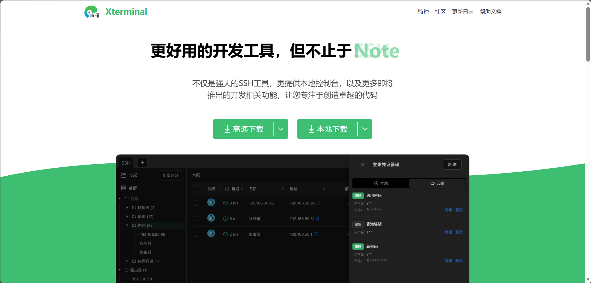
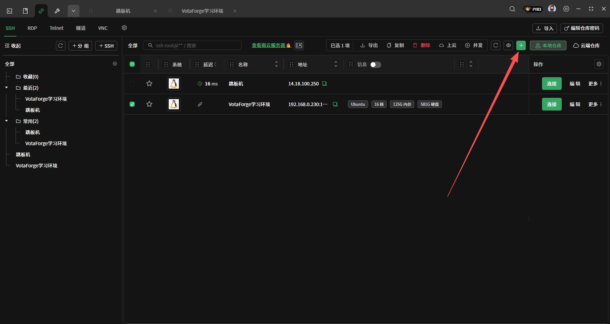
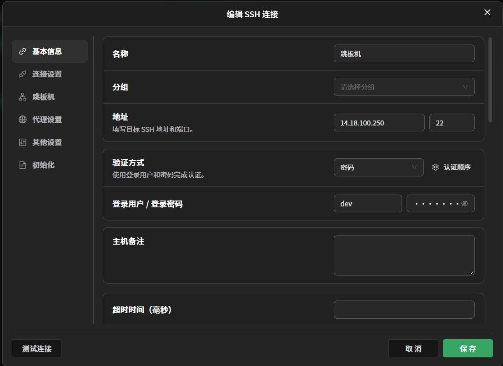
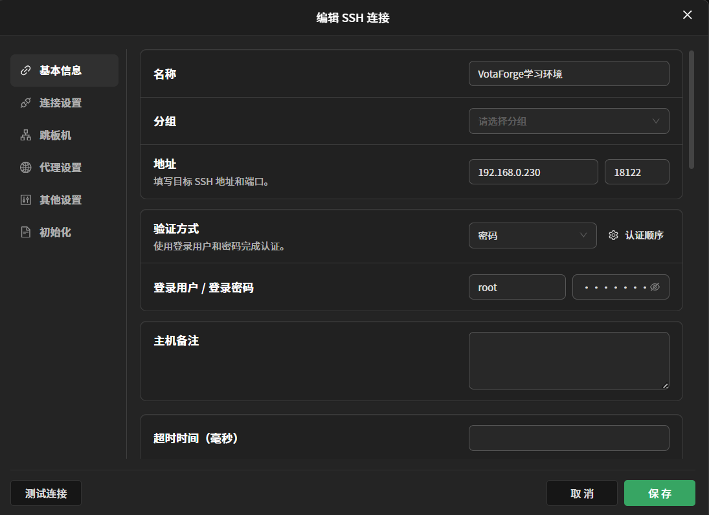
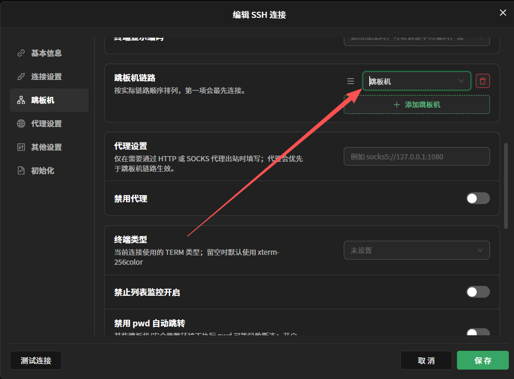
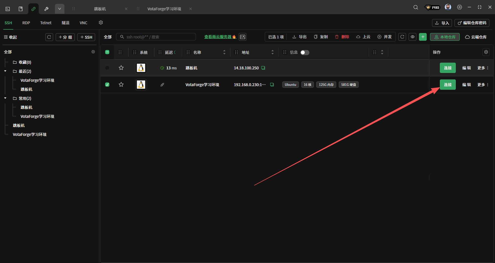
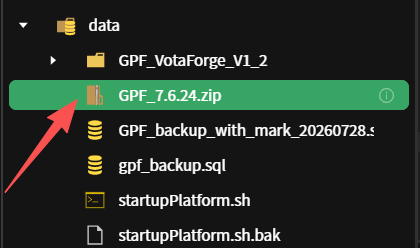
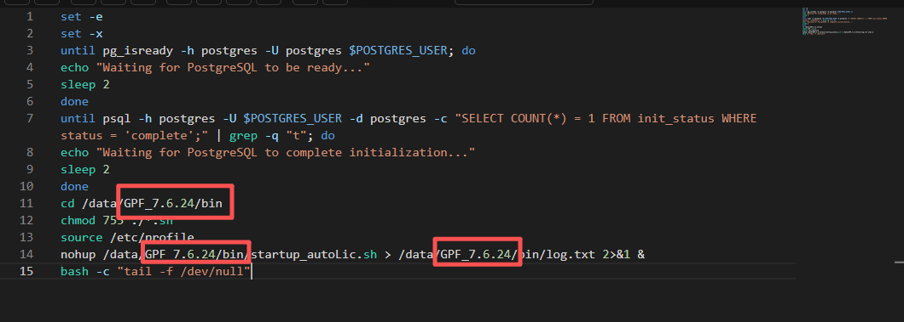

环境更新操作指南
快速上手版 · 照着做就行
本文档不讲概念，只讲操作。按步骤 1 → 8 顺序执行即可完成环境更新。每步配截图，照着做就行。
步骤一：下载跳板机
操作
• 打开浏览器，访问 https://www.terminal.icu/
• 下载并安装 Xterminal SSH 工具
• Xterminal 是一个 SSH 客户端，用于连接跳板机和云服务器

图 1：Xterminal 官网下载页面
步骤二：新建连接
2.1 新建跳板机连接
• 打开 Xterminal，点击「+ SSH」按钮
• 填写跳板机连接信息：
•   名称：跳板机
•   地址：14.18.100.250
•   端口：22
•   登录用户：dev
•   验证方式：密码

图 2：新建 SSH 连接
2.2 新建云服务器连接
• 再次点击「+ SSH」按钮
• 填写云服务器连接信息：
•   名称：VotaForge学习环境（或其他自定义名称）
•   地址：192.168.0.230
•   端口：18122
•   登录用户：root
•   验证方式：密码

图 3：跳板机 SSH 连接详情

图 4：云服务器 SSH 连接详情（192.168.0.230:18122，root）
2.3 配置跳板机链路
• 编辑云服务器连接的「跳板机」设置
• 在「跳板机链路」中添加第一步创建的跳板机
• 保存配置

图 5：跳板机链路设置
步骤三：连接云服务器
操作
• 在云服务器连接项右侧点击「连接」按钮
• Xterminal 会自动先连接跳板机，再通过跳板机连接云服务器

图 6：连接云服务器
提示：连接成功后，终端会显示云服务器的命令行提示符（如 root@xxx）。此时你就可以在云服务器上执行后续命令了。
步骤四：下载新环境并上传
操作
• 在浏览器中访问 http://14.18.100.250:8989/release/GPF/
• 下载最新版本的 GPF 压缩包（如 GPF_7.6.24.zip）
• 通过 Xterminal 的文件传输功能，将压缩包上传到云服务器的 /data 目录

图 7：/data 目录下的 GPF_7.6.24.zip 文件
提示：上传方式：在 Xterminal 中打开 SFTP 面板，直接拖拽文件到 /data 目录即可。
步骤五：解压压缩包
操作
• 在云服务器终端中执行以下命令：
cd /data && unzip -o GPF_7.6.24.zip
提示：-o 参数表示覆盖已有文件。如果旧版本正在运行，建议先停止服务再解压。
步骤六：修改启动脚本
操作
• 编辑 /data/startupPlatform.sh 脚本文件
• 将脚本中的旧版本路径改为新版本路径
• 例如，将 /data/GPF_VotaForge_V1_2/ 改为 /data/GPF_7.6.24/

图 8：startupPlatform.sh 中修改路径为 /data/GPF_7.6.24/
需要修改的位置通常有：
1. cd 命令中的目录路径
2. chmod 命令中的路径
3. nohup 启动命令中的路径
4. 日志输出路径
步骤七：复制配置文件
操作
• 从旧项目目录复制配置文件到新项目目录：
cp /data/GPF_VotaForge_V1_2/conf/base_advance.conf /data/GPF_7.6.24/conf/
cp /data/GPF_VotaForge_V1_2/conf/license.data /data/GPF_7.6.24/conf/
cp /data/GPF_VotaForge_V1_2/conf/starter.xml /data/GPF_7.6.24/conf/
cp /data/GPF_VotaForge_V1_2/conf/license.properties /data/GPF_7.6.24/conf/
cp -r /data/GPF_VotaForge_V1_2/conf/web/* /data/GPF_7.6.24/conf/web/
7.1 修改 starter.xml
• 查看复制过来的 starter.xml：
cat /data/GPF_7.6.24/conf/starter.xml
• 需要删除 GDK 相关的 starter 配置项
GDK starter 通常与图形界面相关，在服务器端环境不需要。打开 starter.xml 找到 GDK 相关的 starter 节点并删除。
步骤八：上传前端文件
操作
• 先在本地准备好前端压缩包（如 CDP.zip）
• 通过 scp 命令上传到跳板机：
scp -P 27022 CDP.zip root@podman230:/data/GPF_7.6.24/webapps
• 或者在跳板机上直接下载/复制前端包
• 上传到 /data/GPF_7.6.24/webapps 目录后解压：
cd /data/GPF_7.6.24/webapps && unzip -o CDP.zip
提示：如果版本号不同（如 7.6.23 或 7.6.24），请根据实际情况修改路径。
操作总结
• 1. 下载 Xterminal → https://www.terminal.icu/
• 2. 新建跳板机连接（14.18.100.250:22，dev）+ 云服务器连接（192.168.0.230:18122，root），配置跳板机链路
• 3. 连接云服务器
• 4. 下载 GPF 包（http://14.18.100.250:8989/release/GPF/）并上传到 /data
• 5. 解压：cd /data && unzip -o GPF_7.6.24.zip
• 6. 修改 startupPlatform.sh 中的路径为 /data/GPF_7.6.24/
• 7. 复制旧项目的 conf 配置文件，删除 starter.xml 中的 GDK starter
• 8. 上传前端文件到 /webapps 并解压
