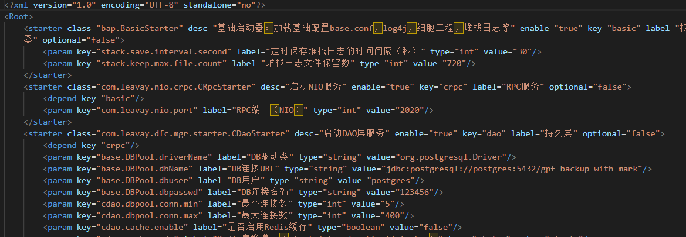

# 数据库导出与迁移操作指南

> **快速上手版** · 照着做就行
>
> 本文档不讲概念，只讲操作。按步骤 1 → 5 顺序执行即可完成数据库导出与迁移。

---

## 步骤一：查看数据库连接信息

### 操作

- 在项目的 `/conf/starter.xml` 文件中找到「DB链接URL」
- 可以看到数据库主机地址、端口、数据库名等信息



---

## 步骤二：导出数据库

### 2.1 使用 pg_dump 导出

在源数据库服务器上执行以下命令：

```bash
pg_dump -U [数据库用户名] -h [数据库主机地址] -p [端口] -d [源数据库名] > [导出文件名.sql]
```

> **实际操作示例**（用户名 `postgres`，密码 `123456`，数据库名 `GPF`）：
> ```bash
> pg_dump -h postgres -U postgres -d GPF > GPF_backup_test.sql
> ```
>
> 💡 `pg_dump` 是 PostgreSQL 自带的备份工具，会将整个数据库导出为 SQL 脚本文件。

### 2.2 传输到目标服务器

使用 `scp` 命令将 SQL 文件传输到目标服务器：

```bash
scp [本地文件路径] [目标服务器SSH用户名]@[目标服务器IP]:[目标服务器存放路径]
```

> **实际操作示例**（目标服务器 `14.18.100.250`，用户 `hezp`）：
> ```bash
> scp GPF_backup_test.sql hezp@14.18.100.250:/home/hezp
> ```

---

## 步骤三：创建新数据库

### 操作

**1. 连接到目标数据库服务器：**

```bash
psql -h postgres -U postgres
# 输入密码（默认：123456）
```

**2. 创建新数据库：**

```sql
create database [新数据库名];
```

> ⚠️ 数据库名称如果不用引号包裹，会自动变为全小写。建议创建后用 `\l` 命令查看确认。

**3. 退出 psql：**

```bash
\q
```

---

## 步骤四：导入数据

### 操作

**1. 进入备份文件所在目录**

**2. 执行导入命令：**

```bash
psql -h [数据库主机地址] -U [数据库用户名] [目标数据库名] < [SQL文件存放路径]
```

> **实际操作示例：**
> ```bash
> psql -h postgres -U postgres gpf_backup_test < /home/hezp/GPF_backup_test.sql
> ```
>
> 💡 导入过程可能需要几分钟时间，取决于数据库大小。导入完成后会返回命令行提示符。

---

## 步骤五：修改项目配置并重启服务

### 5.1 修改 starter.xml

- 在项目的 `/conf/starter.xml` 文件中找到「DB链接URL」
- 将数据库名称修改为新创建的数据库名称
- **只需要修改 URL 中的数据库名部分**，其他配置（主机、端口、用户名、密码）保持不变

### 5.2 重启服务

- 进入 **计算资源管理 → 云服务器**
- 找到对应的服务实例
- 点击「重启」按钮重启服务

> 💡 重启服务后，新数据库配置才会生效。可以通过访问系统验证数据是否正常加载。

---

## 操作总结

| # | 操作 | 命令 |
|---|------|------|
| 1 | 查看 DB 链接 URL | 打开 `/conf/starter.xml` |
| 2 | 导出数据库 | `pg_dump -h postgres -U postgres -d GPF > GPF_backup_test.sql` |
| 3 | 传输到目标服务器 | `scp GPF_backup_test.sql hezp@14.18.100.250:/home/hezp` |
| 4 | 创建新数据库 | `create database 新数据库名;` |
| 5 | 导入数据 | `psql -h postgres -U postgres gpf_backup_test < /home/hezp/GPF_backup_test.sql` |
| 6 | 修改 starter.xml | 将 DB 链接 URL 中的数据库名改为新数据库名 |
| 7 | 重启服务 | 在云服务器管理界面重启对应服务 |
