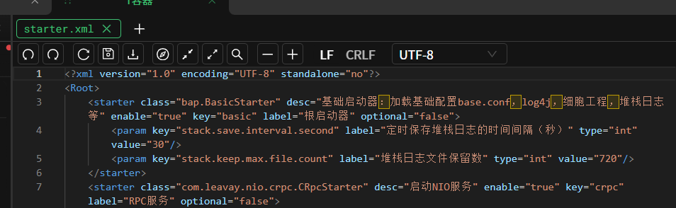
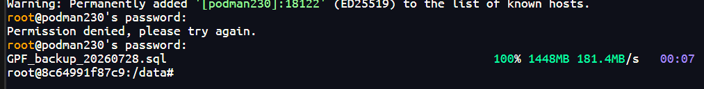
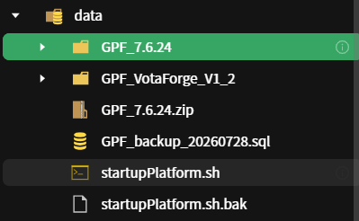
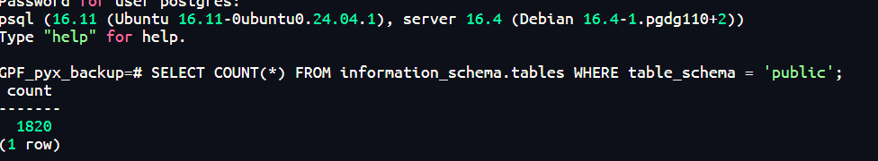
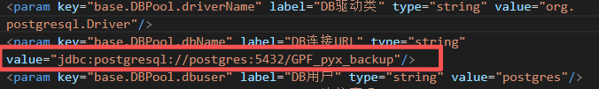
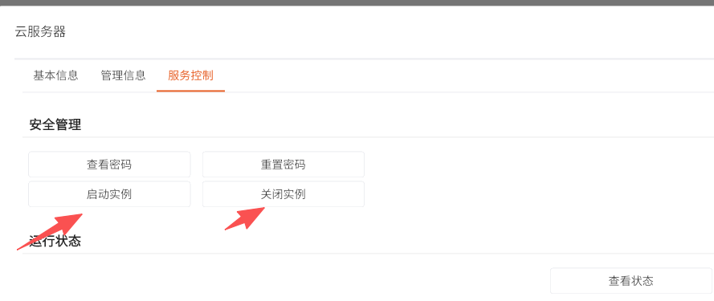
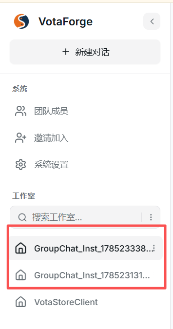

# 数据库导出与导入教程

## 一、导出数据库

### 1.1 查看数据库连接信息

在容器内执行以下命令查看数据库配置：

cat /data/GPF\_7.6.24/conf/starter.xml | grep -A 5 "持久层"

找到以下关键信息（示例）：

- 数据库主机：postgres

- 端口：5432

- 数据库名：GPF

- 用户名：postgres

- 密码：123456

### 1.3 导出数据库

在容器内执行导出命令：

cd /data

pg\_dump -h postgres -U postgres -d GPF > GPF\_backup\_$(date +%Y%m%d).sql

输入密码：123456

导出过程可能需要几分钟，耐心等待。

导出完成后检查文件：

ls -lh GPF\_backup\_\*.sql

### 1.4 传输备份文件

## 方法一：传输到跳板机

将备份文件从容器传输到跳板机：

scp /data/GPF\_backup\_20260728.sql hezp@14.18.100.250:/home/hezp/

输入跳板机密码。传输完成后，对方可以从跳板机下载该文件。

## 方法二：直接传输到对方容器（如果是同一个IP）

如果知道对方的容器SSH端口（例如 18122），可以直接传输：

scp -P 18122 /data/GPF\_backup\_20260728.sql root@podman230:/data/

输入对方容器的root密码。

## 二、导入数据库

### 2.1 接收备份文件

从跳板机或对方容器获取备份文件到本地容器的 /data 目录。

确认文件已存在：

ls -lh /data/\*.sql

### 2.2 连接数据库

psql -h postgres -U postgres

输入密码：123456

### 2.3 创建新数据库

在数据库命令行中执行：

CREATE DATABASE "GPF\_backup\_导入来源";

**注意**：使用引号可以保留大小写，不使用引号会自动转为小写。

确认数据库创建成功：

\\l

退出数据库：

\\q

### 2.4 导入数据

在容器内执行导入命令：

psql -h postgres -U postgres GPF\_backup\_导入来源 < /data/收到的备份文件名.sql

输入密码：123456

导入过程可能需要几分钟，会显示大量的 CREATE TABLE、CREATE INDEX 等信息。

### 2.5 验证导入成功

连接到新导入的数据库：

psql -h postgres -U postgres -d GPF\_backup\_导入来源

查看表数量：

SELECT COUNT(\*) FROM information\_schema.tables WHERE table\_schema = 'public';

查看表的总数是否有问题（一般新环境都是1820张）

退出数据库：

\\q

## 三、修改应用配置

### 3.1 编辑配置文件

修改项目配置，使应用连接到新导入的数据库：

vi /data/GPF\_7.6.24/**conf**/starter.xml

在 vi 编辑器中：

1. 按 / 键搜索：/GPF"

1. 按 i 键进入编辑模式

1. 找到：value="jdbc:postgresql://postgres:5432/GPF"

1. 修改为：value="jdbc:postgresql://postgres:5432/GPF\_backup\_导入来源"

1. 按 Esc 键退出编辑模式

1. 输入 :wq 保存并退出

1. 

### 3.2 重启服务

## 方法一：通过平台重启（推荐）

1. 登录计算资源管理平台

1. 进入【云服务器】

1. 找到对应的容器服务

1. 点击【停止】

1. 等待停止完成后，点击【启动】

1. 

## 方法二：在容器内手动重启

# 停止服务

pkill -f java

# 确认进程已停止

ps aux | grep java

# 启动服务

nohup /data/GPF\_7.6.24/bin/startup\_autoLic.sh > /data/GPF\_7.6.24/bin/log.txt 2>&1 &

# 查看启动日志

tail -f /data/GPF\_7.6.24/bin/log.txt

看到"系统启动完成"后按 Ctrl+C 退出日志查看。

### 3.3 验证应用

打开浏览器访问应用地址：

http://demo.kwaidoo.com/你的环境名/VotaForge/

登录后检查：

1. 应用是否正常运行

1. 能否看到对方导入的数据

1. 功能是否正常使用

